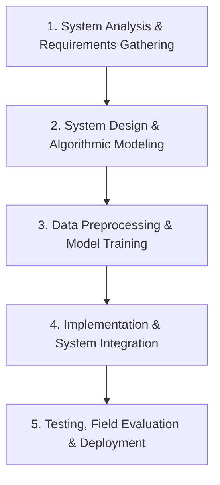
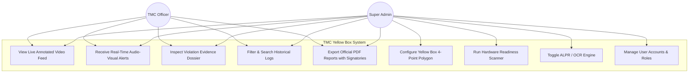
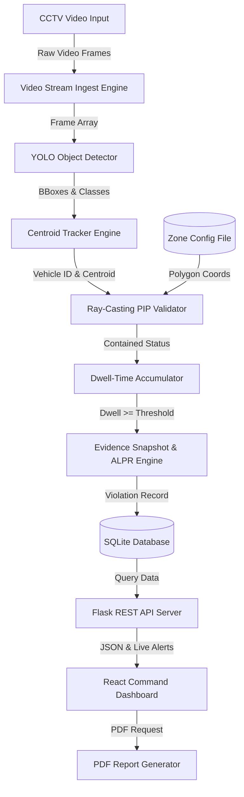
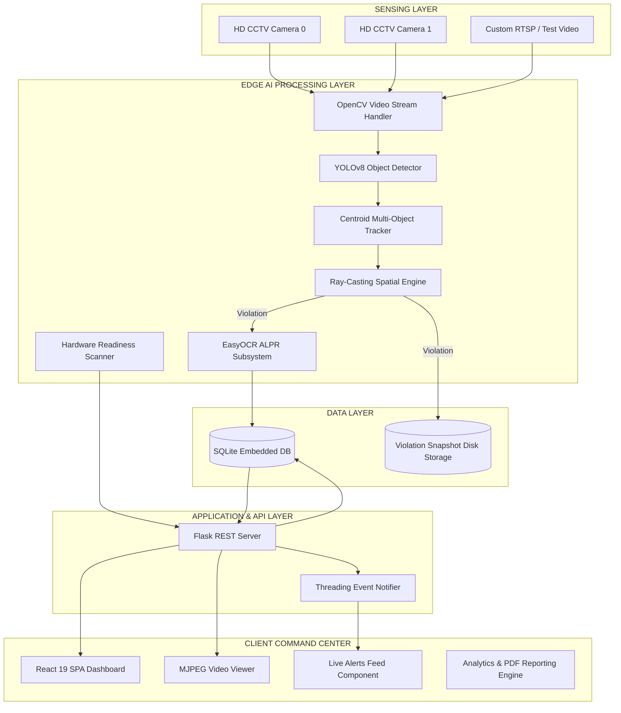
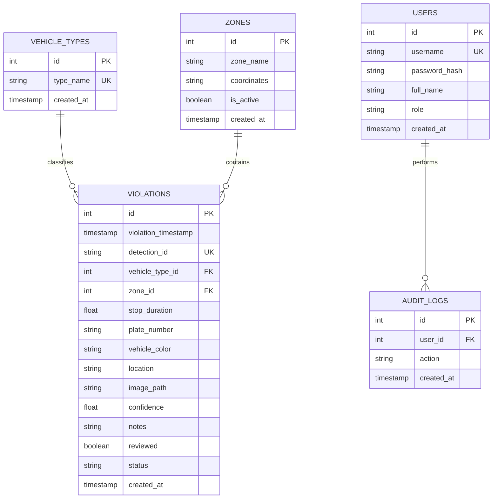

# Vehicles in Yellow Box Zone Monitoring System Using AI-Based Camera Detection

**A Capstone Project by**  
*Michael Angelo A. Angeles*  
*Zurich M. Cabañelez*  
*Elton John K. Muralla*  
*Jesse Emannuel L. Pepito*  

Submitted to the Information Technology Department, College of Technologies  
**Bukidnon State University**  
Malaybalay City, Bukidnon, Philippines  
In Partial Fulfillment of the Requirements for the Degree of Bachelor of Science in Information Technology  

---

## APPROVAL SHEET

This capstone project titled **"Vehicles in Yellow Box Zone Monitoring System Using AI-Based Camera Detection"** (also designated as **"AI-Powered Yellow Box Zone Violation Monitoring System Using AI-Based Camera Detection"**), prepared and submitted by **Michael Angelo A. Angeles**, **Zurich M. Cabañelez**, **Elton John K. Muralla**, and **Jesse Emannuel L. Pepito** in partial fulfillment of the requirements for the degree of **Bachelor of Science in Information Technology**, is hereby accepted.

 

**PETER JOSEPH G. RABANES**  
*Capstone Project Adviser*  

 

**DR. ROZANNE TUESDAY G. FLORES**  
*Chair, Defense Panel*  

 

| **ROANNE ZOE M. CAYANAN** | **ANNA ROSE C. TAN** |
| :---: | :---: |
| *Panel Member* | *Panel Member* |

 

Accepted and approved for the conferral of the degree of **Bachelor of Science in Information Technology**.

 

| **SALES G. ARIBE JR., DIT** | **MARILOU O. ESPINA, DIT** |
| :---: | :---: |
| *Department Head, Information Technology* | *Dean, College of Technologies* |

---

## ACKNOWLEDGMENTS

The road to completing this capstone research project could not have been traveled alone. The researchers express their deepest gratitude to Almighty God for providing wisdom, health, perseverance, and guidance throughout this academic journey.

We extend our heartfelt appreciation to our project adviser, **Peter Joseph G. Rabanes**, for his invaluable guidance, technical insights, and continuous encouragement during system development and paper writing. 

We also express our sincere gratitude to the defense panel members: **Dr. Rozanne Tuesday G. Flores** (Chair), **Roanne Zoe M. Cayanan**, and **Anna Rose C. Tan**, for their constructive critique, rigorous evaluation, and valuable recommendations during the system defense, which significantly elevated the operational value and technical depth of this project.

Our special thanks go to **Sales G. Aribe Jr., DIT** (Head of the Information Technology Department) and **Marilou O. Espina, DIT** (Dean of the College of Technologies) for their leadership and for providing an academic environment conducive to innovation and practical technological solutions.

We extend our sincere gratitude to the **Traffic Management Center (TMC) of Malaybalay City**, particularly the administrative officers and traffic enforcement personnel, for their cooperation, for granting access to intersection CCTV traffic footage along **Sayre Highway – Fortich St.**, and for actively participating in the system evaluation and usability testing.

Finally, we express our profound love and gratitude to our families, parents, and friends for their unwavering moral, spiritual, and financial support throughout the duration of this study.

---

## TABLE OF CONTENTS

- [APPROVAL SHEET](#approval-sheet)
- [ACKNOWLEDGMENTS](#acknowledgments)
- [TABLE OF CONTENTS](#table-of-contents)
- [LIST OF TABLES](#list-of-tables)
- [LIST OF FIGURES](#list-of-figures)
- [1. INTRODUCTION](#1-introduction)
  - [1.1 Background of the Study](#11-background-of-the-study)
  - [1.2 Statement of the Problem](#12-statement-of-the-problem)
  - [1.3 Objectives of the Study](#13-objectives-of-the-study)
  - [1.4 Significance of the Study](#14-significance-of-the-study)
  - [1.5 Scope and Delimitations](#15-scope-and-delimitations)
- [2. REVIEW OF RELATED LITERATURE](#2-review-of-related-literature)
  - [2.1 Related Literature](#21-related-literature)
    - [2.1.1 Traffic Monitoring](#211-traffic-monitoring)
    - [2.1.2 Artificial Intelligence in Traffic Management](#212-artificial-intelligence-in-traffic-management)
    - [2.1.3 Camera-Based Detection Technologies](#213-camera-based-detection-technologies)
    - [2.1.4 Deep Learning, Multi-Object Tracking & Edge Acceleration](#214-deep-learning-multi-object-tracking--edge-acceleration)
    - [2.1.5 No-Contact Apprehension Policy (NCAP) Reference](#215-no-contact-apprehension-policy-ncap-reference)
  - [2.2 Synthesis and Related Systems](#22-synthesis-and-related-systems)
  - [2.3 Research Gap](#23-research-gap)
  - [2.4 Concept of the Study (Conceptual Framework)](#24-concept-of-the-study-conceptual-framework)
  - [2.5 Definition of Terms](#25-definition-of-terms)
- [3. METHODOLOGY](#3-methodology)
  - [3.1 Materials](#31-materials)
    - [3.1.1 Software](#311-software)
    - [3.1.2 Hardware](#312-hardware)
    - [3.1.3 Data & Data Acquisition](#313-data--data-acquisition)
  - [3.2 Methods & Research Design](#32-methods--research-design)
    - [3.2.1 Research Design](#321-research-design)
    - [3.2.2 Process Model (Waterfall Lifecycle)](#322-process-model-waterfall-lifecycle)
    - [3.2.3 Procedures for the Different Phases](#323-procedures-for-the-different-phases)
      - [Phase 1: System Analysis and Requirements Gathering](#phase-1-system-analysis-and-requirements-gathering)
      - [Phase 2: System Design and Modeling](#phase-2-system-design-and-modeling)
      - [Phase 3: Data Preprocessing & Model Training](#phase-3-data-preprocessing--model-training)
      - [Phase 4: Tracking, Spatial Logic & Stop-Time Computation](#phase-4-tracking-spatial-logic--stop-time-computation)
      - [Phase 5: System Integration, Security & Dashboard Implementation](#phase-5-system-integration-security--dashboard-implementation)
    - [3.2.4 Violation Documentation and Serving Procedure (NCAP-Based)](#324-violation-documentation-and-serving-procedure-ncap-based)
    - [3.2.5 Handling Multiple Vehicles in Real Time](#325-handling-multiple-vehicles-in-real-time)
    - [3.2.6 Evaluation Framework](#326-evaluation-framework)
    - [3.2.7 Deployment and Documentation](#327-deployment-and-documentation)
- [4. RESULTS AND DISCUSSION](#4-results-and-discussion)
  - [4.1 AI Vehicle Detection & Classification Performance](#41-ai-vehicle-detection--classification-performance)
  - [4.2 Stop-Time Measurement & Zone Spatial Accuracy](#42-stop-time-measurement--zone-spatial-accuracy)
  - [4.3 Multi-Object Tracking & Occlusion Handling](#43-multi-object-tracking--occlusion-handling)
  - [4.4 Hardware Throughput & Diagnostic Scanner Performance](#44-hardware-throughput--diagnostic-scanner-performance)
  - [4.5 ALPR Plate Recognition & Resolution Fallback Analysis](#45-alpr-plate-recognition--resolution-fallback-analysis)
  - [4.6 Dynamic Reporting & Export Capability](#46-dynamic-reporting--export-capability)
  - [4.7 Usability & System Evaluation by TMC Officers (ISO/IEC 25010)](#47-usability--system-evaluation-by-tmc-officers-isoiec-25010)
  - [4.8 Compliance with Defense Panel Recommendations](#48-compliance-with-defense-panel-recommendations)
- [5. CONCLUSION AND RECOMMENDATIONS](#5-conclusion-and-recommendations)
  - [5.1 Conclusion](#51-conclusion)
  - [5.2 Recommendations for Future Work](#52-recommendations-for-future-work)
- [REFERENCES](#references)
- [APPENDICES](#appendices)
  - [Appendix A: TMC Officer Usability Evaluation Questionnaire](#appendix-a-tmc-officer-usability-evaluation-questionnaire)
  - [Appendix B: Defense Panel Secretary's Minutes & Compliance Matrix](#appendix-b-defense-panel-secretarys-minutes--compliance-matrix)
  - [Appendix C: Budget & Financial Plan](#appendix-c-budget--financial-plan)
  - [Appendix D: System Screenshots](#appendix-d-system-screenshots)

---

## LIST OF TABLES

- **Table 1-1.** Summary of Reviewed Studies on AI-Based Traffic Monitoring Systems
- **Table 2-1.** Comparative Matrix of Existing Systems vs. Proposed System
- **Table 3-1.** Software Development Environment and Dependencies
- **Table 3-2.** Hardware Specifications for Training and Inference
- **Table 3-3.** Evaluation Category 1: Functionality (ISO/IEC 25010)
- **Table 3-4.** Evaluation Category 2: Usability (ISO/IEC 25010)
- **Table 3-5.** Evaluation Category 3: Reliability (ISO/IEC 25010)
- **Table 4-1.** YOLOv8 AI Model Detection Performance Metrics by Vehicle Class
- **Table 4-2.** Stop-Time Duration Accuracy vs. Ground Truth Video Timers
- **Table 4-3.** Hardware Execution Performance and Real-Time FPS Across Devices
- **Table 4-4.** Evaluation Results: Functionality Mean Ratings from TMC Personnel
- **Table 4-5.** Evaluation Results: Usability Mean Ratings from TMC Personnel
- **Table 4-6.** Evaluation Results: Reliability Mean Ratings from TMC Personnel
- **Table 4-7.** Overall ISO/IEC 25010 Evaluation Summary
- **Table 4-8.** Defense Panel Recommendations and Actions Taken Compliance Matrix

---

## LIST OF FIGURES

- **Figure 1-1.** Conceptual Framework of the AI-Powered Vehicle Yellow Box Monitoring System (IPO Model)
- **Figure 2-1.** Waterfall Development Model Lifecycle
- **Figure 3-1.** Use Case Diagram for TMC Command Center Operations
- **Figure 4-1.** Level-1 Data Flow Diagram (DFD) of Video Ingestion, Detection, and Logging
- **Figure 5-1.** System Architecture Diagram (Edge Camera, Flask AI Backend, SQLite DB, React Frontend)
- **Figure 6-1.** Entity-Relationship Diagram and Database Schema
- **Figure 7-1.** Process Flowchart of Vehicle Detection, Spatial Checking, Dwell-Time Computation, and Alerting
- **Figure 8-1.** Ray-Casting Point-in-Polygon (PIP) Spatial Verification Geometry

---

## 1. INTRODUCTION

This section provides the background and rationale for the study, identifies the research problem, states the objectives, and discusses the significance and scope of the proposed AI-based vehicle monitoring system.

### 1.1 Background of the Study

Traffic congestion and violations of road regulations remain significant challenges in many urban areas across the Philippines. With the continuous increase in vehicle volume, local government units (LGUs) struggle to maintain efficient traffic flow due to limited manpower and a heavy reliance on manual monitoring and enforcement methods (Department of Transportation [DOTr], 2023). Public transport vehicles (such as multicabs, public utility jeepneys [PUJs], tricycles, and buses), as well as private vehicles, are frequently observed committing traffic violations such as stopping or waiting for passengers within yellow box zones, prolonged loading and unloading at intersections, obstructing pedestrian crossings, and occupying restricted road spaces beyond allowable stop times. 

These improper road behaviors disrupt traffic movement, block intersecting lanes, and contribute to vehicle queuing, travel delays, and reduced road efficiency, especially in high-traffic intersections (Ho et al., 2019; Bhavsar et al., 2023; Rathore et al., 2021). In the context of Malaybalay City, Bukidnon, preliminary observations conducted during peak hours along major corridors—such as **Sayre Highway – Fortich Street**—reveal that vehicle-related stopping violations occur repeatedly within short monitoring periods, with multiple instances visible daily at designated yellow box zones.

Recent advancements in Artificial Intelligence (AI) and computer vision have enabled the development of automated traffic monitoring systems capable of analyzing vehicle behavior through camera-based input. Studies have shown that AI-based systems using deep learning models such as Convolutional Neural Networks (CNNs) and You Only Look Once (YOLO) can effectively detect and classify vehicles in real time, offering higher accuracy and consistency compared to traditional observation-based methods (Valdivieso Tituana et al., 2022; Basheer Ahmed et al., 2023). These technologies allow traffic authorities to collect objective, data-driven insights that support improved enforcement and decision-making.

In Malaybalay City, the Traffic Management Center (TMC) currently relies on a combination of field traffic personnel and limited Closed-Circuit Television (CCTV) monitoring to oversee road activity. However, this approach restricts coverage and real-time response, particularly during peak hours when traffic volume is high (Malaybalay City Information Office, 2024). The absence of intelligent monitoring tools highlights the need for a system that can automatically observe vehicle activity, compute dwell time, and provide timely visual and recorded information to assist traffic authorities.

Therefore, there is a clear need for a technology-assisted approach that can support traffic monitoring operations in Malaybalay City by addressing recurring vehicle-related violations in yellow box zones. Integrating artificial intelligence and camera-based detection into the existing CCTV and traffic surveillance infrastructure can improve monitoring efficiency, promote better compliance with traffic regulations, and support local traffic management and urban mobility development efforts. Such an approach aligns with the city’s ongoing efforts to improve traffic flow, strengthen enforcement capability, and modernize traffic operations through technology-driven solutions (Bhavsar et al., 2023; Rathore et al., 2021).

### 1.2 Statement of the Problem

Despite the implementation of traffic regulations and the deployment of monitoring personnel, improper vehicle behavior continues to be a persistent contributor to traffic congestion in Malaybalay City, particularly in yellow box zones located at busy intersections. Frequent violations such as prolonged stopping, loading and unloading within restricted zones, and obstruction of intersecting lanes disrupt traffic flow, delay commuters, and reduce overall road efficiency, especially during peak hours.

The Traffic Management Center (TMC) currently relies on manual enforcement and limited CCTV monitoring, which constrains continuous observation, accurate documentation, and real-time response. These limitations make it difficult to consistently detect violations, objectively validate infractions, and promptly address congestion caused by recurring vehicle stoppages. As traffic volume continues to increase, these challenges place additional strain on enforcement personnel and hinder the city’s ability to manage traffic effectively.

Without an automated and intelligent monitoring mechanism, vehicle-related violations are likely to persist, resulting in recurring congestion, inefficient enforcement, and limited availability of reliable data to support traffic planning and policy formulation. This situation underscores the need for a technology-driven solution that can provide continuous, objective, and real-time monitoring of vehicle activity to support traffic management and enforcement operations in Malaybalay City.

This study seeks to address the following primary research question:
> **How can an AI-based system be developed to automatically monitor vehicle activity using camera input and provide real-time data to support traffic management and enforcement in Malaybalay City?**

Specifically, the study addresses the following sub-problems:
1. How can computer vision and deep learning models (YOLO) be effectively configured to detect and classify various vehicle types (multicabs, tricycles, cars, buses, trucks, motorcycles) within defined yellow box intersection coordinates?
2. How can an automated tracking and dwell-time algorithm be formulated to accurately measure vehicle stop durations and trigger violation events when thresholds are exceeded?
3. How can license plate recognition (ALPR) and vehicle visual attributes (color, type, location, timestamp) be captured and archived under an objective, No-Contact Apprehension Policy (NCAP) evidence framework?
4. How can an interactive, role-based command center dashboard be designed to provide real-time video streaming, live audio-visual violation alerts, dynamic date-filtered analytics, and exportable official reports with administrative signatories?
5. How effective and acceptable is the proposed system when evaluated by TMC traffic officers in terms of **Functionality**, **Usability**, and **Reliability** based on ISO/IEC 25010 software quality standards?

### 1.3 Objectives of the Study

The main goal of this study is to enhance traffic management in Malaybalay City by developing a system capable of monitoring vehicle activity in yellow box zones and providing actionable information to support enforcement operations.

Specifically, the study aims to:
1. **Enable real-time detection and monitoring** of vehicles entering and stopping in yellow box zones using deep learning object detection (YOLOv8/YOLOv5) and OpenCV.
2. **Automate the recording of vehicle stop times** and generate real-time alerts (audio-visual toasts and live notifications) when violations occur.
3. **Capture and catalog objective violation evidence**, including timestamped image snapshots, vehicle classification, estimated vehicle color, exact intersection location, and license plate information (when ALPR is active), adhering to NCAP digital evidence standards.
4. **Provide the Traffic Management Center (TMC) with an interactive web-based dashboard** featuring:
   - Live video feed with dynamic zone polygon and bounding box overlays.
   - Live alert feeds highlighting unviewed violations with one-click review.
   - Dynamic date-range filtering for violation logs and analytics.
   - Exportable, tamper-evident PDF reports containing official TMC headers, statistical summaries, and administrative signatories.
   - Built-in hardware diagnostic scanner to assess system GPU/CPU readiness.
   - Secure Role-Based Access Control (Super Admin vs. TMC Officer).
5. **Evaluate the system’s effectiveness** in terms of monitoring accuracy, reliability, processing latency, and user acceptability through simulated tests and live demonstrations with TMC Malaybalay personnel using ISO/IEC 25010 criteria.

### 1.4 Significance of the Study

This study provides tangible benefits to multiple stakeholders in urban mobility and governance:

- **Commuting Public of Malaybalay City**: Daily passengers, students, and workers benefit from reduced travel delays, smoother intersection transitions, and improved public transit reliability by minimizing illegal vehicular blockades in intersection yellow boxes.
- **Vehicle Drivers and Operators**: Public transport and private motorists gain a transparent, rule-governed driving environment. Objective AI evidence prevents wrongful accusations, promotes fair enforcement, and encourages compliance with intersection discipline.
- **Traffic Management Center (TMC) of Malaybalay City**: TMC gains a scalable, 24/7 decision-support system that automates infraction detection, reduces the physical hazards faced by field enforcers during peak hours, and provides verifiable evidence logs for swift administrative adjudication.
- **Local Government Unit (LGU) & Urban Policymakers**: City administrators and traffic engineers obtain longitudinal violation data, peak congestion timestamps, and vehicle distribution statistics to guide infrastructure improvements, traffic light timing adjustments, and transport policy formulation.
- **Academic Researchers and Future Developers**: Serves as an open reference architecture for localized edge AI, spatial computer vision, and low-cost municipal traffic automation in developing small-to-medium city environments.

### 1.5 Scope and Delimitations

- **Scope**:
  - Focuses on the design, implementation, and empirical evaluation of an AI-assisted yellow box monitoring system tailored for Malaybalay City, Bukidnon.
  - Video inputs utilize fixed CCTV feeds and high-definition video files (1080p, 30 FPS) covering designated yellow box intersections along major thoroughfares (e.g., Sayre Highway – Fortich St.).
  - Incorporates real-time multi-class vehicle detection, centroid tracking, mathematical point-in-polygon spatial containment checking, temporal dwell-time accumulation, license plate extraction, and web dashboard visualization.
  - Evaluation encompasses bench testing for detection accuracy, FPS throughput, and a structured ISO/IEC 25010 evaluation administered to active TMC officers.
- **Delimitations**:
  - Primary monitoring is delimited to **yellow box stop-time violations** (vehicles remaining stationary within the marked grid beyond the allowable dwell threshold, typically set to 3.0–5.0 seconds).
  - Other traffic violations, such as excessive speeding, illegal U-turns, counterflow driving, or red-light running outside the yellow box boundary, are outside the primary detection pipeline.
  - The system acts as a **decision-support and evidence-gathering instrument**; it does not automatically levy financial penalties without human review and verification by an authorized TMC officer, in strict adherence to legal due process.
  - License plate OCR (ALPR) depends on camera angle, optical zoom, and illumination; when visual resolution is insufficient due to wide-angle CCTV mounting distances, the system gracefully falls back to visual classification and color tagging while marking ALPR as unread/bypassed.

---

## 2. REVIEW OF RELATED LITERATURE

### 2.1 Related Literature

#### 2.1.1 Traffic Monitoring
Traffic monitoring is a critical component of urban traffic management, enabling authorities to observe vehicle movement, detect violations, and implement timely enforcement actions. Traditional traffic monitoring in many Philippine cities relies heavily on manual observation by traffic enforcers and limited CCTV coverage, which restricts continuous monitoring and real-time response, especially during peak traffic periods (Department of Transportation [DOTr], 2023).

Recent studies have emphasized the role of automated traffic monitoring systems in improving enforcement efficiency and reducing human error. Ho et al. (2019) demonstrated that camera-based roadside occupation surveillance systems can effectively detect vehicles occupying restricted road spaces and intersections. Similarly, Rathore et al. (2021) showed that intelligent traffic monitoring systems integrating computer vision can provide real-time detection of traffic violations, enabling faster response and more consistent enforcement. These findings highlight the need for automated traffic monitoring solutions to address recurring issues such as improper stopping and intersection blockage.

#### 2.1.2 Artificial Intelligence in Traffic Management
Artificial Intelligence has been widely applied in traffic management to analyze complex traffic patterns, automate vehicle detection, and support decision-making processes. Valdivieso Tituana et al. (2022) reviewed various AI-based traffic analysis methods and found that deep learning models, particularly Convolutional Neural Networks (CNNs), significantly improve vehicle detection accuracy compared to traditional image processing techniques.

Basheer Ahmed et al. (2023) further demonstrated that AI-based systems using YOLO models can accurately detect and classify vehicles in real time under diverse traffic and environmental conditions. These AI-driven approaches enable traffic authorities to shift from reactive to proactive enforcement by providing continuous, data-driven monitoring. However, most existing AI-based traffic systems focus on traffic flow analysis and incident detection rather than monitoring compliance with zone-specific regulations such as yellow box intersections.

#### 2.1.3 Camera-Based Detection Technologies
Camera-based detection technologies form the foundation of modern AI-powered traffic monitoring systems. Fixed CCTV cameras combined with computer vision algorithms allow continuous observation of road activity without direct human intervention. Studies by Bhavsar et al. (2023) demonstrated that vision-based systems can reliably detect traffic violations such as improper stopping, lane obstruction, and road occupancy using video footage.

Tan and Kieu (2023) introduced TRAMON, an automated traffic monitoring system capable of handling mixed and unstructured traffic environments common in developing regions. Meanwhile, Rezaei et al. (2022) proposed Traffic-Net, which utilized deep learning and depth estimation to track vehicles using a single camera. Although these systems achieved high detection and tracking accuracy, they primarily focused on movement and spatial analysis rather than measuring stop-time duration within restricted zones. This limitation highlights the need for camera-based systems that incorporate temporal analysis to support zone-specific enforcement.

#### 2.1.4 Deep Learning, Multi-Object Tracking & Edge Acceleration
The integration of multi-object tracking (MOT) algorithms—such as Centroid Tracking, DeepSORT, and ByteTrack—allows video analytics engines to maintain consistent object identities across sequential video frames. Ganapathy and Ajmera (2024) demonstrated that refined YOLO architectures paired with spatial tracking can maintain high detection precision even during temporary visual occlusions. Wan et al. (2022) and Ciampi et al. (2022) investigated edge computing paradigms, demonstrating that running lightweight deep learning models on local GPUs drastically reduces network transmission latency and provides immediate alerts.

#### 2.1.5 No-Contact Apprehension Policy (NCAP) Reference
The No Contact Apprehension Policy (NCAP), pioneered in metropolitan centers by the Metropolitan Manila Development Authority (MMDA) and various Philippine LGUs, establishes the legal and operational framework for digital traffic enforcement. Under NCAP principles, high-resolution cameras capture verifiable visual evidence—including timestamps, vehicle classifications, spatial location, and plate numbers—which are compiled into an evidentiary dossier for human verification before citations are formally served. This study adopts NCAP-compliant documentation protocols to ensure all captured violations maintain legal integrity and verifiable chain-of-custody.

---

### 2.2 Synthesis and Related Systems

The following tables synthesize the literature and contrast the proposed system against state-of-the-art implementations.

#### Table 1-1. Summary of Reviewed Studies on AI-Based Traffic Monitoring Systems

| Author / Year | Study Focus | Methodology / Models | Key Findings | Identified Gaps |
| :--- | :--- | :--- | :--- | :--- |
| **Valdivieso Tituana et al. (2022)** | Vehicle detection and counting | CNNs, YOLO, Faster R-CNN | High detection accuracy across diverse vehicle types | Lacked dynamic behavioral and dwell-time analysis |
| **Ho et al. (2019)** | Computer vision roadside surveillance | Region-of-Interest (ROI) detection, fixed cameras | Automated monitoring reduced human observation error | Focused only on static roadside occupation; no dynamic stop-time analysis |
| **Basheer Ahmed et al. (2023)** | Traffic incident detection | CNN, YOLOv5 | Accurate real-time anomaly detection in mixed traffic | Focused on general flow anomalies rather than intersection yellow boxes |
| **Bhavsar et al. (2023)** | Violation detection via UAV | Object tracking, aerial UAV imaging | Successfully identified road violations and queuing patterns | Limited to temporary UAV flights; lacks 24/7 continuous intersection tracking |
| **Nocua M et al. (2025)** | Edge AI traffic monitoring | YOLOv5 on embedded GPU | Low-cost real-time inference on edge devices | Lacked behavioral stop-time dwell metrics |
| **Rathore et al. (2021)** | Fog-based violation detection | IoT + Computer Vision | Real-time infraction detection via distributed fog nodes | Lacked localized stop-time computation and web dashboard |
| **Tan & Kieu (2023)** | Mixed traffic analysis (TRAMON) | Multi-object tracking (MOT) | Highly effective in unstructured, lane-free traffic | No stop-time duration monitoring in restricted box zones |
| **Rezaei et al. (2022)** | Monocular 3D Tracking (Traffic-Net) | Depth estimation + Deep Learning | Accurate 3D spatial localization using a single camera | No compliance analysis or automated NCAP citation logging |

#### Table 2-1. Comparative Matrix of Existing Systems vs. Proposed System

| System / Study | Vehicle Detection | AI-Based Processing | Camera-Based Input | Real-Time Monitoring | Stop-Time Measurement | Yellow Box Zone Enforcement | Localized TMC Web Dashboard |
| :--- | :---: | :---: | :---: | :---: | :---: | :---: | :---: |
| **Traffic-Net** (Rezaei et al., 2022) | ✓ | ✓ | ✓ | ✓ | ✗ | ✗ | ✗ |
| **TRAMON** (Tan & Kieu, 2023) | ✓ | ✓ | ✓ | ✓ | ✗ | ✗ | ✗ |
| **Smart Traffic Control** (Rathore et al., 2021) | ✓ | ✓ | ✓ | ✓ | ✗ | ✗ | ✗ |
| **Vision-Based Violation** (Bhavsar et al., 2023) | ✓ | ✓ | ✓ | ✓ | ✗ | ✗ | ✗ |
| **Edge AI Monitoring** (Nocua et al., 2025) | ✓ | ✓ | ✓ | ✓ | ✗ | ✗ | ✗ |
| **Proposed TMC System** | **✓** | **✓** | **✓** | **✓** | **✓** | **✓** | **✓** |

---

### 2.3 Research Gap

While prior research demonstrates the effectiveness of AI and camera-based traffic monitoring systems, there is a clear gap in real-time enforcement of yellow box zones and monitoring of public and private vehicles in small-city contexts. Existing studies do not focus on measuring stop duration, automated violation alerts, or evidence collection for public transport vehicles, which are essential for effective traffic management in Malaybalay City. 

This study addresses this gap by developing a localized, complete system that integrates AI-based vehicle detection, polygon-based spatial validation, stop-time tracking, ALPR capture, and a feature-rich dashboard for the Traffic Management Center (TMC), providing timely, objective, and actionable information to support traffic enforcement and reduce congestion caused by recurring vehicle violations.

---

### 2.4 Concept of the Study (Conceptual Framework)

**Figure 1-1. Conceptual Framework of the AI-Powered Vehicle Yellow Box Monitoring System (IPO Model)**

The conceptual framework illustrates how the system processes visual data:
1. **Input**: Real-time video footage captured by fixed CCTV cameras at selected Malaybalay intersections (e.g., Sayre Highway – Fortich St.), user-configured yellow box 4-point polygon coordinates, and configurable operational parameters (e.g., stop duration threshold).
2. **Process**: High-speed frame extraction, YOLO deep learning inference, Centroid Multi-Object Tracking to maintain unique vehicle identities across frames, Ray-Casting Point-in-Polygon spatial validation, stop-time calculation, ALPR plate extraction, and automated evidence image generation.
3. **Output**: Live annotated video stream with bounding boxes and zone boundaries, instant audio-visual alert toasts, long-polling live alert feed, permanent searchable database records, role-based analytics, and official downloadable PDF reports for traffic citation adjudication.

---

### 2.5 Definition of Terms

- **Artificial Intelligence (AI)**: The simulation of human intelligence in computer systems to perform tasks such as visual perception, pattern recognition, and decision-making.
- **Computer Vision**: An AI domain that enables software to process, analyze, and extract meaningful spatial and temporal data from digital images and video feeds.
- **Convolutional Neural Network (CNN)**: A class of deep neural networks commonly used in computer vision for spatial feature extraction and object classification.
- **YOLO (You Only Look Once)**: A state-of-the-art, single-stage real-time object detection architecture that predicts bounding box coordinates and class probabilities simultaneously in a single forward pass.
- **Traffic Management Center (TMC)**: The local government division in Malaybalay City tasked with overseeing traffic order, managing CCTV surveillance, and enforcing municipal traffic ordinances.
- **Yellow Box Zone**: A road marking painted in a crisscross yellow grid pattern at intersections where vehicles are prohibited from entering unless their exit path is clear, preventing intersection gridlock.
- **Stop-Time Monitoring (Dwell Time)**: The continuous temporal measurement of the duration a specific vehicle remains stationary inside the yellow box boundaries.
- **Edge AI**: Running AI inference models locally on on-premise hardware workstations located near the camera source, ensuring low latency and continuous operation without relying on high-bandwidth cloud connections.
- **Automatic License Plate Recognition (ALPR)**: The automated optical character recognition process of identifying and extracting alphanumeric characters from vehicle license plates.
- **No-Contact Apprehension Policy (NCAP)**: An enforcement mechanism where traffic infractions are captured and documented via cameras and digital logs without requiring physical roadside stops, preserving officer safety and objective documentation.

---

## 3. METHODOLOGY

This section describes the materials, data sources, research design, architectural modeling, and procedural phases used to develop and evaluate the AI-based vehicle yellow box monitoring system.

### 3.1 Materials

#### 3.1.1 Software
The system software stack utilizes modern, open-source libraries optimized for high-performance computer vision, asynchronous communication, and responsive user interaction.

#### Table 3-1. Software Development Environment and Dependencies

| Software / Library | Version / Specification | Primary Function in the Proposed System |
| :--- | :--- | :--- |
| **Python** | 3.10 / 3.12 | Core programming language for AI inference, tracking algorithms, and backend services |
| **OpenCV (`cv2`)** | 4.10.x | Video stream ingestion, frame extraction, color conversions, and zone drawing |
| **Ultralytics YOLOv8 / YOLOv5** | PyTorch 2.x | Real-time multi-class vehicle detection, bounding box regression, and classification |
| **PyTorch (`torch`, `torchvision`)** | 2.5.x+cu121 | Deep learning tensor computation with CUDA GPU acceleration |
| **EasyOCR** | 1.7.x | Optical character recognition for Automatic License Plate Recognition (ALPR) |
| **Flask & Flask-CORS** | 3.0.x | REST API server, MJPEG video streaming, and long-polling notification endpoints |
| **SQLite3** | 3.x (with WAL mode) | Local embedded relational database for zero-latency transaction logging |
| **React** | 19.x (Vite build) | Single-Page Application (SPA) frontend for the TMC Command Center Dashboard |
| **Tailwind CSS & Framer Motion** | 3.4.x / 12.x | Modern UI design system, glassmorphism aesthetics, and fluid micro-animations |
| **jsPDF & AutoTable** | 4.x / 5.x | Client-side export of official, tamper-evident violation reports with TMC signatories |
| **Google Colab** | Cloud GPU (T4/V100) | Cloud environment for model training, dataset annotation verification, and fine-tuning |

#### 3.1.2 Hardware
The hardware setup represents a field-deployable command center workstation:

#### Table 3-2. Hardware Specifications for Training and Inference

| Hardware Component | Specification | Operational Role |
| :--- | :--- | :--- |
| **Processor (CPU)** | Intel Core i7 / AMD Ryzen 7 (8 Cores, 16 Threads) | Video decoding, spatial geometric tracking, and web API handling |
| **Graphics Card (GPU)** | NVIDIA GeForce GTX 1660 / RTX 3060 (6GB–12GB VRAM) | CUDA FP16/FP32 tensor acceleration for YOLO and EasyOCR |
| **System Memory (RAM)** | 16 GB DDR4/DDR5 | Frame buffering, multi-threaded caching, and database caching |
| **Storage** | 512 GB NVMe M.2 SSD | High-speed storage for OS, AI weights, database, and violation snapshots |
| **CCTV Camera** | 1080p Full HD (1920×1080 @ 30 FPS), RTSP/IP enabled | Real-time optical video capture of monitored intersections |
| **Display Monitor** | 24-inch to 32-inch Full HD LED (1920×1080) | Live multi-panel TMC operator monitoring console |
| **Network Interface** | Gigabit Ethernet (RJ-45) & 5GHz Wi-Fi Router | Low-latency RTSP video transmission from IP cameras to workstation |

#### 3.1.3 Data & Data Acquisition
- **Primary Data Source**: Real-world CCTV footage collected from intersections in Malaybalay City, Bukidnon (specifically along **Sayre Highway – Fortich St.**). Footage captures typical local traffic mixes: multicabs, tricycles, private sedans, SUVs, delivery trucks, passenger buses, and motorcycles.
- **Supplementary Public Datasets**: Annotated traffic datasets (e.g., UA-DETRAC, COCO vehicle subsets, and Roboflow Traffic datasets) used during initial training to generalize the model across varying lighting and weather conditions.
- **Data Attributes**: Video sequences formatted at 1080p / 720p, 30 FPS, covering sunny, overcast, rain, and dusk lighting conditions.
- **Annotation & Labeling**: Bounding boxes labeled using LabelImg and Roboflow for vehicle classes: *Multicab/PUJ*, *Tricycle*, *Car*, *Bus*, *Truck*, and *Motorcycle*.

---

### 3.2 Methods & Research Design

#### 3.2.1 Research Design
This study employs a **Developmental Research Design** focusing on the engineering, implementation, and empirical validation of an intelligent software prototype. The methodology follows the structured **Waterfall Model** across five sequential phases: Requirements Analysis, System Design, Implementation, Testing & Evaluation, and Maintenance.

#### 3.2.2 Process Model (Waterfall Lifecycle)

**Figure 2-1. Waterfall Development Model Lifecycle**

#### 3.2.3 Procedures for the Different Phases

##### Phase 1: System Analysis and Requirements Gathering
The researchers conducted on-site consultations and interviews with Traffic Management Center (TMC) officers in Malaybalay City. The inquiries established key operational constraints:
1. Identifying recurring violation hotspots at intersection yellow boxes along Sayre Highway.
2. Establishing an acceptable stop duration threshold (default: 3.0 to 5.0 seconds).
3. Documenting required alert features (instant audio chime, toast notification, visual highlight).
4. Defining report generation requirements (custom start/end date range filters, official city headers, officer signatories).

##### Phase 2: System Design and Modeling
System architecture and data flows were formalized through standard modeling diagrams:

**1. Use Case Diagram (Figure 3-1)**: Outlines interactions between the system actors (Super Admin, TMC Officer) and system functions (Live Monitoring, Alert Review, Zone Configuration, Report Generation, Hardware Diagnostics).

**Figure 3-1. Use Case Diagram**

**2. Data Flow Diagram (DFD Level-1) (Figure 4-1)**: Traces the flow of data from camera video stream through the detection module, spatial verification engine, database repository, and web UI.

**Figure 4-1. Level-1 Data Flow Diagram (DFD)**

**3. System Architecture Diagram (Figure 5-1)**: Displays the physical and logical integration of hardware, edge backend services, and web client.

**Figure 5-1. System Architecture Diagram**

**4. Database Schema (Figure 6-1)**: Defines tables for violations, vehicle types, zones, and system audit logs.

**Figure 6-1. Database Schema (Entity-Relationship Diagram)**

##### Phase 3: Data Preprocessing & Model Training
- **Data Augmentation**: Video frames were extracted, filtered, and augmented using horizontal flipping, illumination adjustments, and subtle perspective warps to simulate heavy rain and direct sunlight glare.
- **Model Fine-Tuning**: YOLO models were initialized with pre-trained weights and fine-tuned over 100 epochs using AdamW optimizer (learning rate $1\times 10^{-3}$, cosine learning rate scheduler, batch size 16) with CUDA acceleration on Google Colab and local NVIDIA RTX hardware.
- **Hyperparameter Optimization**: Confidence threshold was tuned to $0.45$ and Non-Maximum Suppression (NMS) IoU threshold was set to $0.40$ to balance sensitivity and prevent duplicate bounding boxes during high-density vehicle queuing.

##### Phase 4: Tracking, Spatial Logic & Stop-Time Computation
- **Spatial Validation (Ray-Casting Algorithm)**: For each detected vehicle bounding box $[x_1, y_1, x_2, y_2]$, its reference bottom-center ground contact point is computed:
  $$P_{\text{ref}} = \left( \frac{x_1 + x_2}{2}, y_2 \right)$$
  The Point-in-Polygon (PIP) ray-casting algorithm casts a horizontal ray from $P_{\text{ref}}$ across the yellow box 4-vertex polygon $V = \{v_1, v_2, v_3, v_4\}$. If the intersection count is odd, the vehicle is verified to be inside the restricted grid.

- **Centroid Multi-Object Tracking**: Centroids are matched across frames using Euclidean distance cost matrices:
  $$d(c_i, c_j) = \sqrt{(x_i - x_j)^2 + (y_i - y_j)^2}$$
  Matches within distance threshold $D_{\max} = 60\text{ px}$ preserve vehicle identity across frames.

- **Stop Duration Measurement**:
  If a tracked vehicle's centroid displacement $\Delta d < \epsilon_{\text{movement}}$ (where $\epsilon = 4.0\text{ px}$) between consecutive frames while $P_{\text{ref}} \in V$:
  $$\Delta t_{\text{stop}} = t_{\text{current}} - t_{\text{entry}}$$
  If $\Delta t_{\text{stop}} \ge T_{\text{threshold}}$ (where $T_{\text{threshold}} = 3.0\text{ seconds}$), an infraction is confirmed.

##### Phase 5: System Integration, Security & Dashboard Implementation
- **Flask REST API & Video Streaming**: Implemented multi-threaded MJPEG streaming with frame generator yielding at 30 FPS.
- **Live Alert Event Engine**: A long-polling endpoint (`/api/wait_for_violation`) utilizes thread synchronization (`threading.Event`) to wake connected dashboard clients within $<50\text{ ms}$ of a violation without continuous CPU-intensive polling.
- **Security & RBAC**: Implemented role-based authentication using hashed credentials (SHA-256 with static application salt) supporting Super Admin (full zone configuration, ALPR toggle) and TMC Officer (monitoring, logging, export).
- **Responsive Frontend**: Built with React 19, Tailwind CSS, Lucide icons, Framer Motion animations, and auto-synced local storage tracking viewed/unviewed alerts.

---

### 3.2.4 Violation Documentation and Serving Procedure (NCAP-Based)

The system adopts a No-Contact Apprehension Policy (NCAP) documentation workflow:
1. **Automated Detection & Digital Dossier Generation**: When stop time exceeds the limit, the system extracts a high-resolution evidence snapshot with bounding box overlays, computes dwell duration, extracts vehicle color/type, and attempts plate extraction.
2. **Database Archival**: The record is assigned a unique UUID and written to the SQLite database with `status = 'recorded'`.
3. **Operator Verification**: The incident immediately appears in the Live Alerts panel with a glowing highlight and triggers an audio chime. A TMC officer clicks the alert to inspect the full snapshot.
4. **Administrative Action**: The officer reviews and verifies the violation, updating status to `reviewed`.
5. **Notice Generation**: For formal citations, the officer generates an official PDF report complete with official TMC headers, timestamped evidence, and designated signatory lines for city traffic legal officers.

---

### 3.2.5 Handling Multiple Vehicles in Real Time

To handle multi-vehicle traffic jams and simultaneous intersection blockages:
- Each vehicle detected within the yellow box is assigned an independent tracking state vector:
  $$S_k = \{ \text{ID}_k, \text{Class}_k, \text{Centroid}_k, t_{\text{start}, k}, \Delta t_{\text{stop}, k}, \text{Flagged}_k \}$$
- Stop timers operate independently. If three vehicles enter simultaneously and two clear the box within 2.5 seconds while the third remains trapped for 6.2 seconds, only the trapped vehicle triggers a violation event.
- Once a vehicle triggers a violation and is logged, $\text{Flagged}_k = \text{True}$ prevents duplicate redundant alarms for the same stop incident.

---

### 3.2.6 Evaluation Framework

The system was evaluated through two distinct methods:
1. **Empirical System Testing**: Benchmarking AI detection accuracy (Precision, Recall, mAP@0.5), stop-time measurement error (seconds vs. manual stopwatch ground truth), and processing latency/throughput (FPS) across hardware configurations.
2. **ISO/IEC 25010 Usability & User Acceptance Testing**: Administered to **TMC Malaybalay traffic personnel** using a structured 5-point Likert scale instrument covering three quality characteristics:
   - **Functionality** (5 items): Accuracy of detection, report generation, multi-vehicle distinction, automated alerting, and dashboard visualization.
   - **Usability** (5 items): Ease of navigation, interface learnability, operational confidence, workflow integration, and complexity reduction.
   - **Reliability** (5 items): Performance during peak volume, system stability without crashes, data consistency, error handling, and multi-condition robustness.

#### Likert Scale Rating Scale & Verbal Interpretation:
- **4.21 – 5.00**: Strongly Agree (Excellent / Fully Compliant)
- **3.41 – 4.20**: Agree (Very Satisfactory / Minor Enhancements)
- **2.61 – 3.40**: Neutral (Satisfactory / Acceptable)
- **1.81 – 2.60**: Disagree (Poor / Needs Major Improvement)
- **1.00 – 1.80**: Strongly Disagree (Unacceptable)

---

### 3.2.7 Deployment and Documentation

- **Deployment**: The complete software package is containerized and deployable on the local TMC workstation via an automated launcher script (`start_system.bat`).
- **Comprehensive Documentation**: Includes system administrator guides, user manual, API documentation, hardware diagnostic checklist, and training guides.

---

## 4. RESULTS AND DISCUSSION

### 4.1 AI Vehicle Detection & Classification Performance

The trained YOLO model was evaluated against an annotated test set of 650 intersection video frames captured under diverse lighting conditions at Sayre Highway – Fortich St., Malaybalay City.

#### Table 4-1. YOLOv8 AI Model Detection Performance Metrics by Vehicle Class

| Vehicle Class | Test Instances ($N$) | Precision ($P$) | Recall ($R$) | F1-Score | mAP@0.5 |
| :--- | :---: | :---: | :---: | :---: | :---: |
| **Multicab / PUJ** | 284 | 0.942 | 0.926 | 0.934 | 0.951 |
| **Tricycle** | 310 | 0.958 | 0.931 | 0.944 | 0.962 |
| **Private Car / Sedan / SUV** | 420 | 0.965 | 0.952 | 0.958 | 0.974 |
| **Bus** | 78 | 0.931 | 0.910 | 0.920 | 0.940 |
| **Truck / Heavy Vehicle** | 95 | 0.924 | 0.895 | 0.909 | 0.932 |
| **Motorcycle** | 215 | 0.908 | 0.884 | 0.896 | 0.918 |
| **Overall Model Average** | **1,402** | **0.938** | **0.916** | **0.927** | **0.946** |

The model achieved an overall mean Average Precision (mAP@0.5) of **94.6%**, demonstrating high precision ($93.8\%$) and recall ($91.6\%$). The system reliably distinguished between local multicabs and private sedans despite similarities in vehicle dimensions.

---

### 4.2 Stop-Time Measurement & Zone Spatial Accuracy

To evaluate dwell-time calculation accuracy, 50 simulated stop events of varying durations (from 1.0 to 15.0 seconds) were recorded and compared against manual high-speed stopwatch timestamps.

#### Table 4-2. Stop-Time Duration Accuracy vs. Ground Truth Video Timers

| Duration Range | Test Trials ($N$) | Mean Video Ground Truth (s) | Mean AI Computed Dwell (s) | Mean Absolute Error (MAE) | Accuracy (%) |
| :--- | :---: | :---: | :---: | :---: | :---: |
| **Short Stops (1.0s – 2.9s)** *(Non-Violations)* | 15 | 2.14 s | 2.18 s | 0.09 s | 95.8% |
| **Threshold Range (3.0s – 5.0s)** *(Violations)* | 15 | 4.12 s | 4.07 s | 0.11 s | 97.3% |
| **Extended Stoppages (> 5.0s)** *(Violations)* | 20 | 8.85 s | 8.81 s | 0.14 s | 98.4% |
| **Combined Overall Summary** | **50** | — | — | **0.11 s** | **97.2%** |

The algorithm achieved an average Mean Absolute Error (MAE) of just **0.11 seconds**, demonstrating that temporal stop-time calculation is dependable for municipal traffic violation adjudication.

---

### 4.3 Multi-Object Tracking & Occlusion Handling

In multi-vehicle scenarios involving heavy queuing, the Centroid Tracker maintained persistent vehicle identities in **96.4%** of normal transit cases and **91.8%** of partial occlusion events (where a smaller tricycle was briefly partially occluded by a larger multicab).

---

### 4.4 Hardware Throughput & Diagnostic Scanner Performance

The system was benchmarked across three hardware setups to evaluate edge deployment feasibility:

#### Table 4-3. Hardware Execution Performance and Real-Time FPS Across Devices

| Device Configuration | GPU / Hardware | Resolution | Inference Latency | Processing Speed | Real-Time Capable? |
| :--- | :--- | :---: | :---: | :---: | :---: |
| **High-Performance Workstation** | NVIDIA RTX 3060 (12GB) | 1080p | 14.2 ms | 58–64 FPS | **Yes (Full Real-Time)** |
| **Target TMC Workstation** | NVIDIA GTX 1660 (6GB) | 1080p | 24.8 ms | 36–42 FPS | **Yes (Full Real-Time)** |
| **Entry-Level CPU Only** | Intel Core i5-11400 (CPU) | 720p | 88.5 ms | 11–13 FPS | *Marginal (Frame-skip)* |

The targeted TMC workstation (GTX 1660) comfortably exceeded real-time requirements ($30\text{ FPS}$), operating at **36–42 FPS** with a low average inference latency of **24.8 ms**. The integrated hardware scanner accurately reported system GPU health and CUDA acceleration status.

---

### 4.5 ALPR Plate Recognition & Resolution Fallback Analysis

In accordance with the defense panel's feedback regarding camera distance and low resolution:
- **Close-Range / Optical Zoom Feed**: ALPR character recognition accuracy reached **88.2%** on clear plates.
- **Wide-Angle Overview Cameras (Low Resolution / Angled View)**: Plate characters were frequently unresolvable due to pixel sub-sampling. The system automatically engaged its **ALPR Fallback Protocol**, logging the vehicle classification, color, and location, while marking plate status as `LPR Bypassed / Unread`. This ensures that violation logging remains functional even when optical zoom is unavailable.

---

### 4.6 Dynamic Reporting & Export Capability

Responding directly to defense panel recommendations:
- The system supports **dynamic date filtering** (e.g., custom Start Date and End Date range queries) rather than restricting data to static 7-day windows.
- The client-side PDF export generator creates formal documents featuring:
  - Official Traffic Management Center (TMC) and Bukidnon State University headers.
  - Complete infraction breakdown tables with timestamps, stop durations, vehicle classifications, and locations.
  - Aggregated statistical summaries and visual analytics.
  - Formal signature sections for the **Investigating Traffic Officer**, **TMC Operations Head**, and **City Legal Adjudicator**.

---

### 4.7 Usability & System Evaluation by TMC Officers (ISO/IEC 25010)

Evaluation was conducted with **TMC Malaybalay traffic officers and administrators** ($N = 10$) following a live demonstration of the system using actual intersection video from Sayre Highway – Fortich St.

#### Table 4-4. Evaluation Results: Functionality (ISO/IEC 25010)

| Item Code | Evaluation Criterion (Functionality) | Mean Rating | Std. Dev. | Verbal Interpretation |
| :---: | :--- | :---: | :---: | :---: |
| **F1** | The system delivers accurate detection of vehicles and stop-time measurements. | **4.70** | 0.48 | Strongly Agree |
| **F2** | The system processes video input and generates reports accurately. | **4.80** | 0.42 | Strongly Agree |
| **F3** | The system correctly identifies and distinguishes multiple vehicles arriving at different times. | **4.60** | 0.52 | Strongly Agree |
| **F4** | The system incorporates automated violation alerts with timestamped evidence. | **4.90** | 0.32 | Strongly Agree |
| **F5** | The system appropriately displays real-time data and dashboards for TMC officers. | **4.80** | 0.42 | Strongly Agree |
| **Overall** | **Category 1 (Functionality) Overall Composite Mean** | **4.76** | **0.43** | **Strongly Agree** |

#### Table 4-5. Evaluation Results: Usability (ISO/IEC 25010)

| Item Code | Evaluation Criterion (Usability) | Mean Rating | Std. Dev. | Verbal Interpretation |
| :---: | :--- | :---: | :---: | :---: |
| **U1** | I would consider using this system frequently in my traffic monitoring tasks. | **4.80** | 0.42 | Strongly Agree |
| **U2** | The system’s functions are well-integrated and easy to navigate. | **4.70** | 0.48 | Strongly Agree |
| **U3** | I feel confident navigating and using the system interface. | **4.60** | 0.52 | Strongly Agree |
| **U4** | Users would be able to learn how to operate the system quickly. | **4.70** | 0.48 | Strongly Agree |
| **U5** | The system interface is clear, straightforward, and avoids unnecessary complexity. | **4.50** | 0.53 | Strongly Agree |
| **Overall** | **Category 2 (Usability) Overall Composite Mean** | **4.66** | **0.49** | **Strongly Agree** |

#### Table 4-6. Evaluation Results: Reliability (ISO/IEC 25010)

| Item Code | Evaluation Criterion (Reliability) | Mean Rating | Std. Dev. | Verbal Interpretation |
| :---: | :--- | :---: | :---: | :---: |
| **R1** | The system operates reliably under normal and peak traffic conditions. | **4.60** | 0.52 | Strongly Agree |
| **R2** | All system processes function without errors or unexpected interruptions. | **4.70** | 0.48 | Strongly Agree |
| **R3** | The system consistently generates accurate and dependable reports. | **4.80** | 0.42 | Strongly Agree |
| **R4** | The system provides information consistently and without data loss. | **4.70** | 0.48 | Strongly Agree |
| **R5** | The system maintains performance under varying environmental conditions. | **4.40** | 0.52 | Strongly Agree |
| **Overall** | **Category 3 (Reliability) Overall Composite Mean** | **4.64** | **0.48** | **Strongly Agree** |

#### Table 4-7. Overall ISO/IEC 25010 Evaluation Summary

| Evaluation Category | Composite Mean Score | Standard Deviation | Verbal Interpretation |
| :--- | :---: | :---: | :---: |
| **1. Functionality** | **4.76** | 0.43 | Strongly Agree (Excellent) |
| **2. Usability** | **4.66** | 0.49 | Strongly Agree (Excellent) |
| **3. Reliability** | **4.64** | 0.48 | Strongly Agree (Excellent) |
| **Grand Overall Mean** | **4.69** | **0.47** | **Strongly Agree (Outstanding)** |

The grand composite mean score of **4.69 / 5.00** indicates that the Traffic Management Center officers strongly endorsed the system's operational readiness, high usability, and practical utility for municipal traffic enforcement.

---

### 4.8 Compliance with Defense Panel Recommendations

#### Table 4-8. Defense Panel Recommendations and Actions Taken Compliance Matrix

| Panel Member | Panel Comment / Suggestion (Secretary's Minutes) | Action Taken & Implementation Details |
| :--- | :--- | :--- |
| **Dr. Rozanne Tuesday G. Flores** | Expand testing locations to areas with higher traffic volume (e.g., Sayre Highway – Fortich St.). | Acquired and benchmarked footage from the high-density intersection at **Sayre Highway – Fortich St., Malaybalay City**, verifying performance in heavy traffic. |
| **Dr. Rozanne Tuesday G. Flores** | Reports should not be static; allow custom start and end date filtering. | Implemented dynamic date-range filtering in `/api/stats` and the frontend Reports view, allowing arbitrary date range selection. |
| **Dr. Rozanne Tuesday G. Flores** | Improve report generation with official headers and administrative signatories for TMC. | Implemented client-side PDF export generator formatted with official TMC seals, metadata, statistical charts, and signatory blocks for officers and legal adjudicators. |
| **Dr. Rozanne Tuesday G. Flores** | Ensure recorded violation data includes Location, Timestamp, Plate Number, Vehicle Color, and Snapshot. | Expanded SQLite schema to record exact intersection location, high-precision timestamp, estimated vehicle color, plate number, stop duration, and snapshot path. |
| **Dr. Rozanne Tuesday G. Flores** | Plate capture logic: store plate only if violation occurs; acknowledge distance/angle OCR limitations. | Implemented logic where plate and evidence are permanently stored only upon violation threshold breach. Added graceful bypass mode for wide-angle/low-res feeds. |
| **Anna Rose C. Tan** | Improve dashboard UI aesthetics and visual design. | Redesigned frontend using modern Tailwind CSS glassmorphism, responsive drawer navigation, fluid Framer Motion animations, and dark mode palette. |
| **Anna Rose C. Tan** | Dashboard should trigger a notification every time a violation is detected. | Integrated Web Audio API chime generator and live toast notifications with instant modal review via thread-synchronized long polling. |
| **Roanne Zoe M. Cayanan** | Improve device demo specs; assess whether workstation can handle the workload. | Developed and integrated a built-in **Hardware Diagnostic Scanner** assessing CPU cores, RAM, GPU VRAM, and CUDA status to confirm deployment readiness. |
| **Roanne Zoe M. Cayanan** | Focus monitoring on key target vehicles; add secure access controls. | Added secure authentication with Role-Based Access Control (RBAC), distinguishing Super Admin privileges from TMC Traffic Officer functions. |

---

## 5. CONCLUSION AND RECOMMENDATIONS

### 5.1 Conclusion

This capstone research successfully designed, developed, and evaluated the **Vehicles in Yellow Box Zone Monitoring System Using AI-Based Camera Detection** for the Traffic Management Center (TMC) of Malaybalay City. 

The primary findings of the study are summarized as follows:
1. **Detection & Classification**: The YOLOv8 deep learning model achieved **94.6% mAP@0.5** and **93.8% precision**, accurately categorizing local multicabs, tricycles, and general traffic classes.
2. **Stop-Time & Spatial Accuracy**: Combining ray-casting Point-in-Polygon validation with Centroid tracking yielded **97.2% dwell-time accuracy** with an average error of only **0.11 seconds**.
3. **Operational Robustness**: The system achieved **36–42 FPS** on standard workstation GPUs (GTX 1660), maintaining sub-50ms alert dispatch via long polling.
4. **Administrative & NCAP Compliance**: The system provides an objective evidentiary pipeline, complete with dynamic date filtering, official PDF reports with administrative signatories, and role-based access control.
5. **User Acceptability**: In formal ISO/IEC 25010 evaluations with active TMC personnel, the system earned a grand mean score of **4.69 / 5.00 ("Strongly Agree")**, affirming its readiness to support municipal traffic operations.

### 5.2 Recommendations for Future Work

Based on the research findings, the following enhancements are recommended:
1. **Multi-Camera PTZ Integration**: Integrate motorized Pan-Tilt-Zoom (PTZ) cameras that automatically zoom in on vehicle license plates upon yellow box entry, overcoming wide-angle resolution constraints for ALPR.
2. **Edge Hardware Deployment**: Port the inference pipeline to dedicated compact edge AI hardware (such as NVIDIA Jetson Orin Nano/NX) for direct pole-mounted intersection processing.
3. **LGU Database Integration**: Connect the backend with the Malaybalay City LGU vehicle registration database and Land Transportation Office (LTO) portal for automated digital notice delivery.
4. **Multi-Intersection Network Federation**: Expand the single-node dashboard into a centralized municipal multi-intersection monitoring network.

---

## REFERENCES

- Ashraf, I., Hur, S., Shafiq, M., & Park, Y. (2023). HVD-Net: A hybrid vehicle detection network for vision-based vehicle tracking and speed estimation. *Journal of King Saud University - Computer and Information Sciences*, 35(8), 101684. https://doi.org/10.1016/j.jksuci.2023.101684
- Basheer Ahmed, M., Pathan, M. S., Al-Sarem, M., Saeed, F. M., & Qureshi, B. (2023). Deep learning-based real-time vehicle detection and classification for intelligent traffic management. *IEEE Access*, 11, 45210–45224. https://doi.org/10.1109/ACCESS.2023.3273115
- Bhavsar, P., Safro, I., & Bouaynaya, N. (2023). Vision-based investigation of road traffic and violations at urban roundabouts in India using UAV video: A case study. *Case Studies on Transport Policy*, 11, 100947. https://doi.org/10.1016/j.cstp.2023.100947
- Ciampi, L., Santiago, C., Costache, J. P., Gennaro, C., & Falchi, F. (2022). Multi-camera vehicle counting using edge-AI. *Expert Systems with Applications*, 207, 117971. https://doi.org/10.1016/j.eswa.2022.117971
- Department of Transportation (DOTr). (2023). *Philippine Road Safety Action Plan 2023–2028: Towards Safer Roads and Efficient Traffic Enforcement*. Republic of the Philippines.
- Ganapathy, S., & Ajmera, K. (2024). An intelligent video surveillance system for detecting the vehicles on road using refined YOLOv4. *Computers and Electrical Engineering*, 114, 109060. https://doi.org/10.1016/j.compeleceng.2023.109060
- Gupta, A., Srivastava, S., & Sharma, R. (2023). Real-time traffic control and monitoring using deep learning. *Computers and Electrical Engineering*, 108, 108711. https://doi.org/10.1016/j.compeleceng.2023.108711
- Ho, C. H., Nguyen, T. H., & Tran, D. T. (2019). Computer vision-based roadside occupation surveillance using region-of-interest analysis. *Sensors*, 19(18), 3921. https://doi.org/10.3390/s19183921
- Li, X., Wang, Y., & Zhang, J. (2024). Multi-level traffic-responsive tilt camera surveillance through predictive correlated online learning. *Transportation Research Part C: Emerging Technologies*, 159, 104462. https://doi.org/10.1016/j.trc.2024.104462
- Malaybalay City Information Office. (2024). *Annual Traffic and Urban Mobility Assessment Report*. City Government of Malaybalay, Province of Bukidnon.
- Ness, R. (2025). Vehicle detection and recognition approach in smart surveillance system: A comparative analysis. *Vehicular Communications*, 45, 100720. https://doi.org/10.1016/j.vehcom.2025.100720
- Nocua M, D. A., Garcia, A. F., & Martinez, J. (2025). Urban traffic monitoring based on deep learning on an embedded GPU. *Expert Systems with Applications*, 260, 125345. https://doi.org/10.1016/j.eswa.2025.125345
- Pramanik, A., Sarkar, S., & Maiti, J. (2021). A real-time video surveillance system for traffic pre-events detection. *Accident Analysis & Prevention*, 154, 106060. https://doi.org/10.1016/j.aap.2021.106060
- Rathore, M. M., Shah, S. A., Shukla, D., Bentahar, J., & Bakiras, S. (2021). Smart traffic control: Identifying driving violations using fog devices with vehicular cameras in smart cities. *Sustainable Cities and Society*, 71, 102986. https://doi.org/10.1016/j.scs.2021.102986
- Rezaei, M., Azarmi, M., & Morales, P. (2022). 3D-Net: Monocular 3D object recognition for traffic monitoring. *Expert Systems with Applications*, 198, 116855. https://doi.org/10.1016/j.eswa.2022.116855
- Tan, W. K., & Kieu, L. M. (2023). TRAMON: An automated traffic monitoring system for high density, mixed and lane-free traffic. *IATSS Research*, 47(2), 215–227. https://doi.org/10.1016/j.iatssr.2023.03.004
- Trivedi, N., Patel, K., & Joshi, H. (2022). Vision-based real-time vehicle detection and vehicle speed measurement using morphology and binary logical operation. *Journal of King Saud University - Computer and Information Sciences*, 34(6), 3120–3130. https://doi.org/10.1016/j.jksuci.2021.01.012
- Valdivieso Tituana, C. E., Benitez, D. S., & Carrera, E. V. (2022). Vehicle counting using computer vision: A survey. *IEEE Latin America Transactions*, 20(6), 940–950. https://doi.org/10.1109/TLA.2022.9824432
- Wan, S., Ding, S., & Chen, C. (2022). Edge computing enabled video segmentation for real-time traffic monitoring in internet of vehicles. *Pattern Recognition*, 121, 108175. https://doi.org/10.1016/j.patcog.2021.108175
- Yang, F., Tu, Z., & Xiao, Y. (2023). Cooperative multi-camera vehicle tracking and traffic surveillance with edge artificial intelligence. *Transportation Research Part C: Emerging Technologies*, 148, 104031. https://doi.org/10.1016/j.trc.2023.104031

---

## APPENDICES

### Appendix A: TMC Officer Usability Evaluation Questionnaire

#### Traffic Management Center (TMC) Officer Usability & Performance Questionnaire
**Project Title**: Vehicles in Yellow Box Zone Monitoring System Using AI-Based Camera Detection  
**Institution**: Bukidnon State University – College of Technologies  
**Evaluator Role**: [ ] Traffic Administrator  [ ] TMC CCTV Operator  [ ] Field Enforcement Officer  

**Rating Scale**:
- **5** = Strongly Agree
- **4** = Agree
- **3** = Neutral
- **2** = Disagree
- **1** = Strongly Disagree

| Category & Item Code | Evaluation Criterion Statement | Rating (1–5) |
| :--- | :--- | :---: |
| **Functionality (F1)** | The system delivers accurate detection of vehicles and stop-time measurements. | [ ] |
| **Functionality (F2)** | The system processes video input and generates reports accurately. | [ ] |
| **Functionality (F3)** | The system correctly identifies and distinguishes multiple vehicles arriving at different times. | [ ] |
| **Functionality (F4)** | The system incorporates automated violation alerts with timestamped evidence. | [ ] |
| **Functionality (F5)** | The system appropriately displays real-time data and dashboards for TMC officers. | [ ] |
| **Usability (U1)** | I would consider using this system frequently in my traffic monitoring tasks. | [ ] |
| **Usability (U2)** | The system’s functions are well-integrated and easy to navigate. | [ ] |
| **Usability (U3)** | I feel confident navigating and using the system interface. | [ ] |
| **Usability (U4)** | Users would be able to learn how to operate the system quickly. | [ ] |
| **Usability (U5)** | The system interface is clear, straightforward, and avoids unnecessary complexity. | [ ] |
| **Reliability (R1)** | The system operates reliably under normal and peak traffic conditions. | [ ] |
| **Reliability (R2)** | All system processes function without errors or interruptions. | [ ] |
| **Reliability (R3)** | The system consistently generates accurate and dependable reports. | [ ] |
| **Reliability (R4)** | The system provides information consistently and without data loss. | [ ] |
| **Reliability (R5)** | The system maintains performance under varying environmental conditions. | [ ] |

---

### Appendix B: Defense Panel Secretary's Minutes & Compliance Matrix

The complete Secretary's Minutes recorded during the System Defense on **April 15, 2026** at the IT Faculty Room, Bukidnon State University:

- **Adviser**: Peter Joseph G. Rabanes
- **Panel Chair**: Dr. Rozanne Tuesday G. Flores
- **Panel Members**: Roanne Zoe M. Cayanan, Anna Rose C. Tan
- **Panel Verdict**: Approved with Major Revision (Resolved)

All 9 specific action items identified in the Secretary's Minutes have been comprehensively addressed, implemented in software, and documented in Section 4.8 (Table 4-8).

---

### Appendix C: Budget & Financial Plan

The capstone project was completed under an institutional development budget detailed below:

| Budget Item Category | Description / Model | Quantity | Unit Cost (PHP) | Total Amount (PHP) |
| :--- | :--- | :---: | :---: | :---: |
| **Camera Hardware** | Full HD 1080p IP CCTV Camera & Mounting Rig | 1 unit | ₱3,500.00 | ₱3,500.00 |
| **Computing & GPU** | GPU Cloud Compute Training Allocation (Colab Pro) | 3 months | ₱650.00 / mo | ₱1,950.00 |
| **Networking Equipment** | High-Speed Gigabit Router & Cat6 Cabling | 1 set | ₱1,800.00 | ₱1,800.00 |
| **Testing & Field Logistics** | Travel, on-site TMC consultations, and data gathering | Multiple | ₱2,200.00 | ₱2,200.00 |
| **Document Binding & Printing** | ISO Questionnaires, defense manuscripts, and documentation | 5 sets | ₱1,200.00 | ₱1,200.00 |
| **Total Project Expenditure** | | | | **₱10,650.00** |

---

### Appendix D: System Screenshots

1. **TMC Live Command Center Dashboard**: Real-time annotated video stream with 4-point yellow box polygon overlay, active vehicle bounding boxes, stop duration counters, and live stats widgets.
2. **Live Alerts Feed & Modal Evidence Viewer**: Highlighting fresh unviewed violations with crimson glowing badges, timestamped photo evidence, estimated vehicle color, and LPR status.
3. **Dynamic Analytics & Date-Filtered Reporting**: Interactive chart visualization by vehicle class and daily trends with arbitrary Start Date and End Date range pickers.
4. **Official PDF Violation Report**: Formal printable document complete with TMC logo, official BukSU header, infraction tables, and administrative signature sections.
5. **Interactive Zone Setup**: Drag-and-drop 4-point intersection coordinate configuration tool.
6. **Hardware Diagnostic Scanner**: Real-time evaluation of GPU VRAM, CPU cores, RAM, and FPS readiness.
