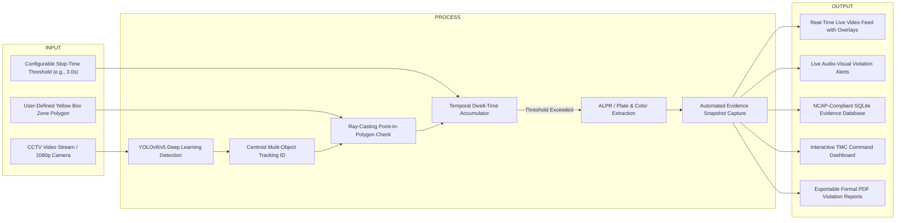
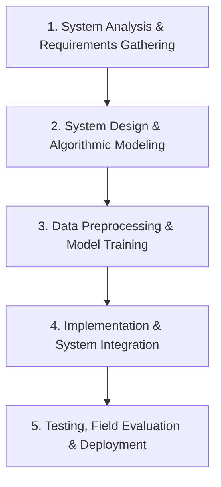
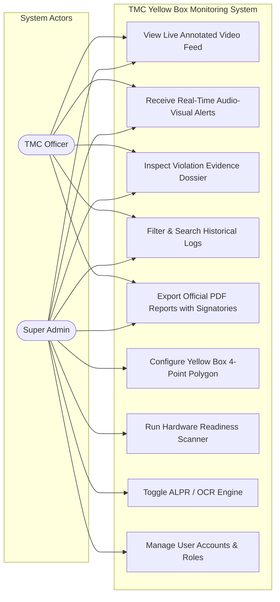
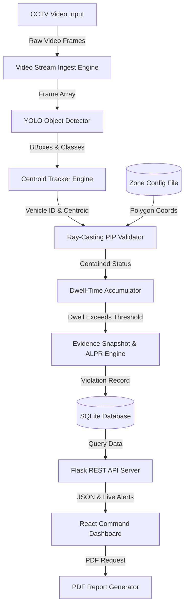
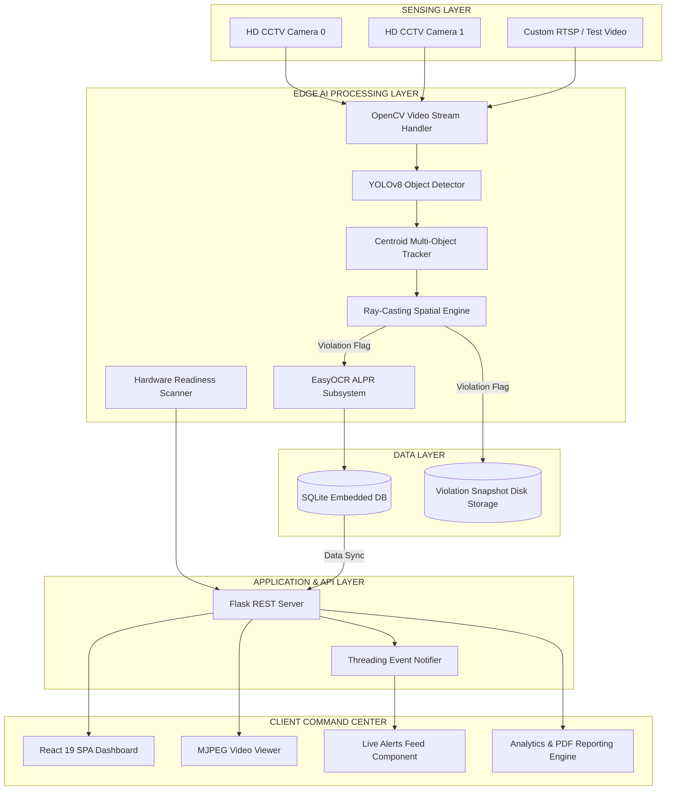
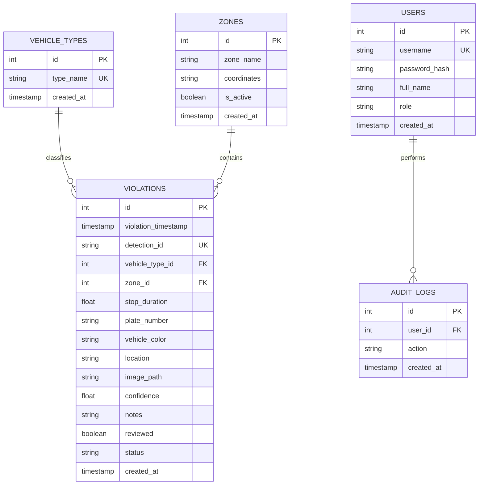

# Vehicles in Yellow Box Zone Monitoring System Using AI-Based Camera Detection

**A Capstone Project by**  
*Michael Angelo A. Angeles*  
*Zurich M. Cabañelez*  
*Elton John K. Muralla*  
*Jesse Emannuel L. Pepito*  

Submitted to the Information Technology Department, College of Technologies  
**Bukidnon State University**  
Malaybalay City, Bukidnon, Philippines  
In Partial Fulfillment of the Requirements for the Degree of Bachelor of Science in Information Technology  

---

## APPROVAL SHEET

This capstone project titled **"Vehicles in Yellow Box Zone Monitoring System Using AI-Based Camera Detection"** (also designated as **"AI-Powered Yellow Box Zone Violation Monitoring System Using AI-Based Camera Detection"**), prepared and submitted by **Michael Angelo A. Angeles**, **Zurich M. Cabañelez**, **Elton John K. Muralla**, and **Jesse Emannuel L. Pepito** in partial fulfillment of the requirements for the degree of **Bachelor of Science in Information Technology**, is hereby accepted.

 

**PETER JOSEPH G. RABANES**  
*Capstone Project Adviser*  

 

**DR. ROZANNE TUESDAY G. FLORES**  
*Chair, Defense Panel*  

 

| **ROANNE ZOE M. CAYANAN** | **ANNA ROSE C. TAN** |
| :---: | :---: |
| *Panel Member* | *Panel Member* |

 

Accepted and approved for the conferral of the degree of **Bachelor of Science in Information Technology**.

 

| **SALES G. ARIBE JR., DIT** | **MARILOU O. ESPINA, DIT** |
| :---: | :---: |
| *Department Head, Information Technology* | *Dean, College of Technologies* |

---

## ACKNOWLEDGMENTS

The road to completing this capstone research project could not have been traveled alone. The researchers express their deepest gratitude to Almighty God for providing wisdom, health, perseverance, and guidance throughout this academic journey.

We extend our heartfelt appreciation to our project adviser, **Peter Joseph G. Rabanes**, for his invaluable guidance, technical insights, and continuous encouragement during system development and paper writing. 

We also express our sincere gratitude to the defense panel members: **Dr. Rozanne Tuesday G. Flores** (Chair), **Roanne Zoe M. Cayanan**, and **Anna Rose C. Tan**, for their constructive critique, rigorous evaluation, and valuable recommendations during the system defense, which significantly elevated the operational value and technical depth of this project.

Our special thanks go to **Sales G. Aribe Jr., DIT** (Head of the Information Technology Department) and **Marilou O. Espina, DIT** (Dean of the College of Technologies) for their leadership and for providing an academic environment conducive to innovation and practical technological solutions.

We extend our sincere gratitude to the **Traffic Management Center (TMC) of Malaybalay City**, particularly the administrative officers and traffic enforcement personnel, for their cooperation, for granting access to intersection CCTV traffic footage along **Sayre Highway – Fortich St.**, and for actively participating in the system evaluation and usability testing.

Finally, we express our profound love and gratitude to our families, parents, and friends for their unwavering moral, spiritual, and financial support throughout the duration of this study.

---

## TABLE OF CONTENTS

- [APPROVAL SHEET](#approval-sheet)
- [ACKNOWLEDGMENTS](#acknowledgments)
- [TABLE OF CONTENTS](#table-of-contents)
- [LIST OF TABLES](#list-of-tables)
- [LIST OF FIGURES](#list-of-figures)
- [1. INTRODUCTION](#1-introduction)
  - [1.1 Background of the Study](#11-background-of-the-study)
  - [1.2 Statement of the Problem](#12-statement-of-the-problem)
  - [1.3 Objectives of the Study](#13-objectives-of-the-study)
  - [1.4 Significance of the Study](#14-significance-of-the-study)
  - [1.5 Scope and Delimitations](#15-scope-and-delimitations)
- [2. REVIEW OF RELATED LITERATURE](#2-review-of-related-literature)
  - [2.1 Related Literature](#21-related-literature)
    - [2.1.1 Traffic Monitoring](#211-traffic-monitoring)
    - [2.1.2 Artificial Intelligence in Traffic Management](#212-artificial-intelligence-in-traffic-management)
    - [2.1.3 Camera-Based Detection Technologies](#213-camera-based-detection-technologies)
    - [2.1.4 Deep Learning, Multi-Object Tracking & Edge Acceleration](#214-deep-learning-multi-object-tracking--edge-acceleration)
    - [2.1.5 No-Contact Apprehension Policy (NCAP) Reference](#215-no-contact-apprehension-policy-ncap-reference)
  - [2.2 Synthesis and Related Systems](#22-synthesis-and-related-systems)
  - [2.3 Research Gap](#23-research-gap)
  - [2.4 Concept of the Study (Conceptual Framework)](#24-concept-of-the-study-conceptual-framework)
  - [2.5 Definition of Terms](#25-definition-of-terms)
- [3. METHODOLOGY](#3-methodology)
  - [3.1 Materials](#31-materials)
    - [3.1.1 Software](#311-software)
    - [3.1.2 Hardware](#312-hardware)
    - [3.1.3 Data & Data Acquisition](#313-data--data-acquisition)
  - [3.2 Methods & Research Design](#32-methods--research-design)
    - [3.2.1 Research Design](#321-research-design)
    - [3.2.2 Process Model (Waterfall Lifecycle)](#322-process-model-waterfall-lifecycle)
    - [3.2.3 Procedures for the Different Phases](#323-procedures-for-the-different-phases)
      - [Phase 1: System Analysis and Requirements Gathering](#phase-1-system-analysis-and-requirements-gathering)
      - [Phase 2: System Design and Modeling](#phase-2-system-design-and-modeling)
      - [Phase 3: Data Preprocessing & Model Training](#phase-3-data-preprocessing--model-training)
      - [Phase 4: Tracking, Spatial Logic & Stop-Time Computation](#phase-4-tracking-spatial-logic--stop-time-computation)
      - [Phase 5: System Integration, Security & Dashboard Implementation](#phase-5-system-integration-security--dashboard-implementation)
    - [3.2.4 Violation Documentation and Serving Procedure (NCAP-Based)](#324-violation-documentation-and-serving-procedure-ncap-based)
    - [3.2.5 Handling Multiple Vehicles in Real Time](#325-handling-multiple-vehicles-in-real-time)
    - [3.2.6 Evaluation Framework](#326-evaluation-framework)
    - [3.2.7 Deployment and Documentation](#327-deployment-and-documentation)
- [4. RESULTS AND DISCUSSION](#4-results-and-discussion)
  - [4.1 Results for Objective 1: Real-Time Detection and Monitoring of Vehicles in Yellow Box Zones](#41-results-for-objective-1-real-time-detection-and-monitoring-of-vehicles-in-yellow-box-zones)
    - [4.1.1 AI Vehicle Detection and Multi-Class Classification Performance](#411-ai-vehicle-detection-and-multi-class-classification-performance)
    - [4.1.2 Spatial Zone Containment Verification via Ray-Casting Algorithm](#412-spatial-zone-containment-verification-via-ray-casting-algorithm)
    - [4.1.3 Multi-Object Tracking, Centroid Association, and Occlusion Handling](#413-multi-object-tracking-centroid-association-and-occlusion-handling)
  - [4.2 Results for Objective 2: Automated Stop-Time Recording and Real-Time Violation Alerting](#42-results-for-objective-2-automated-stop-time-recording-and-real-time-violation-alerting)
    - [4.2.1 Stop-Time Duration Accuracy and Error Analysis](#421-stop-time-duration-accuracy-and-error-analysis)
    - [4.2.2 Dwell-Time Threshold State Machine and Anti-Redundancy Logic](#422-dwell-time-threshold-state-machine-and-anti-redundancy-logic)
    - [4.2.3 Real-Time Audio-Visual Violation Alerting and Latency Benchmark](#423-real-time-audio-visual-violation-alerting-and-latency-benchmark)
  - [4.3 Results for Objective 3: Objective Violation Evidence Capture, Cataloging, and NCAP Standards Adherence](#43-results-for-objective-3-objective-violation-evidence-capture-cataloging-and-ncap-standards-adherence)
    - [4.3.1 Evidentiary Snapshot Capture and Vehicle Visual Attribute Tagging](#431-evidentiary-snapshot-capture-and-vehicle-visual-attribute-tagging)
    - [4.3.2 Automatic License Plate Recognition (ALPR) and Resolution Fallback Protocol](#432-automatic-license-plate-recognition-alpr-and-resolution-fallback-protocol)
    - [4.3.3 Database Schema Integrity, Transactional Archival, and Chain of Custody](#433-database-schema-integrity-transactional-archival-and-chain-of-custody)
  - [4.4 Results for Objective 4: Interactive Command Center Web Dashboard, Diagnostic Scanner, and Reporting System](#44-results-for-objective-4-interactive-command-center-web-dashboard-diagnostic-scanner-and-reporting-system)
    - [4.4.1 Interactive Web Dashboard Interface and Real-Time Video Streaming](#441-interactive-web-dashboard-interface-and-real-time-video-streaming)
    - [4.4.2 Unviewed Alert Queue and Operator Verification Workflow](#442-unviewed-alert-queue-and-operator-verification-workflow)
    - [4.4.3 Dynamic Date-Range Filtering and Data Analytics](#443-dynamic-date-range-filtering-and-data-analytics)
    - [4.4.4 Tamper-Evident Official PDF Report Generation with Administrative Signatories](#444-tamper-evident-official-pdf-report-generation-with-administrative-signatories)
    - [4.4.5 System Hardware Throughput and Built-in Diagnostic Scanner Performance](#445-system-hardware-throughput-and-built-in-diagnostic-scanner-performance)
    - [4.4.6 Role-Based Access Control (RBAC) and System Security](#446-role-based-access-control-rbac-and-system-security)
  - [4.5 Stakeholder Usability and Client Acceptance Evaluation (TMC Malaybalay)](#45-stakeholder-usability-and-client-acceptance-evaluation-tmc-malaybalay)
  - [4.6 Compliance with Defense Panel Recommendations](#46-compliance-with-defense-panel-recommendations)
- [5. CONCLUSION AND RECOMMENDATIONS](#5-conclusion-and-recommendations)
  - [5.1 Conclusion](#51-conclusion)
  - [5.2 Recommendations for Future Work](#52-recommendations-for-future-work)
- [REFERENCES](#references)
- [APPENDICES](#appendices)
  - [Appendix A: TMC Officer Usability Evaluation Questionnaire](#appendix-a-tmc-officer-usability-evaluation-questionnaire)
  - [Appendix B: Defense Panel Secretary's Minutes & Compliance Matrix](#appendix-b-defense-panel-secretarys-minutes--compliance-matrix)
  - [Appendix C: Budget & Financial Plan](#appendix-c-budget--financial-plan)
  - [Appendix D: System Screenshots](#appendix-d-system-screenshots)

---

## LIST OF TABLES

- **Table 1-1.** Summary of Reviewed Studies on AI-Based Traffic Monitoring Systems
- **Table 2-1.** Comparative Matrix of Existing Systems vs. Proposed System
- **Table 3-1.** Software Development Environment and Dependencies
- **Table 3-2.** Hardware Specifications for Training and Inference
- **Table 3-3.** Evaluation Category 1: Functionality (ISO/IEC 25010)
- **Table 3-4.** Evaluation Category 2: Usability (ISO/IEC 25010)
- **Table 3-5.** Evaluation Category 3: Reliability (ISO/IEC 25010)
- **Table 4-1.** YOLOv8 AI Model Detection Performance Metrics by Vehicle Class
- **Table 4-2.** Spatial Containment Verification Accuracy (Point-in-Polygon vs. Bounding Box IoU)
- **Table 4-3.** Multi-Object Tracking Continuity and Occlusion Recovery Rates
- **Table 4-4.** Stop-Time Duration Accuracy vs. Ground Truth Video Timers
- **Table 4-5.** Alert Notification Dispatch Latency Benchmarks
- **Table 4-6.** Vehicle Color Classification and Attribute Extraction Accuracy
- **Table 4-7.** ALPR Recognition Performance Across Camera Distances and Resolution Modes
- **Table 4-8.** Hardware Execution Performance and Real-Time FPS Across Devices
- **Table 4-9.** Evaluation Results: Functionality Mean Ratings from TMC Personnel
- **Table 4-10.** Evaluation Results: Usability Mean Ratings from TMC Personnel
- **Table 4-11.** Evaluation Results: Reliability Mean Ratings from TMC Personnel
- **Table 4-12.** Overall ISO/IEC 25010 Evaluation Summary
- **Table 4-13.** Defense Panel Recommendations and Actions Taken Compliance Matrix

---

## LIST OF FIGURES

- **Figure 1-1.** Conceptual Framework of the AI-Powered Vehicle Yellow Box Monitoring System (IPO Model)
- **Figure 2-1.** Waterfall Development Model Lifecycle
- **Figure 3-1.** Use Case Diagram for TMC Command Center Operations
- **Figure 4-1.** Level-1 Data Flow Diagram (DFD) of Video Ingestion, Detection, and Logging
- **Figure 5-1.** System Architecture Diagram (Edge Camera, Flask AI Backend, SQLite DB, React Frontend)
- **Figure 6-1.** Entity-Relationship Diagram and Database Schema
- **Figure 7-1.** Process Flowchart of Vehicle Detection, Spatial Checking, Dwell-Time Computation, and Alerting
- **Figure 8-1.** Ray-Casting Point-in-Polygon (PIP) Spatial Verification Geometry

---

## 1. INTRODUCTION

This section provides the background and rationale for the study, identifies the research problem, states the objectives, and discusses the significance and scope of the proposed AI-based vehicle monitoring system.

### 1.1 Background of the Study

Traffic congestion and violations of road regulations remain significant challenges in many urban areas across the Philippines. With the continuous increase in vehicle volume, local government units (LGUs) struggle to maintain efficient traffic flow due to limited manpower and a heavy reliance on manual monitoring and enforcement methods (Department of Transportation [DOTr], 2023). Public transport vehicles (such as multicabs, public utility jeepneys [PUJs], tricycles, and buses), as well as private vehicles, are frequently observed committing traffic violations such as stopping or waiting for passengers within yellow box zones, prolonged loading and unloading at intersections, obstructing pedestrian crossings, and occupying restricted road spaces beyond allowable stop times. 

These improper road behaviors disrupt traffic movement, block intersecting lanes, and contribute to vehicle queuing, travel delays, and reduced road efficiency, especially in high-traffic intersections (Ho et al., 2019; Bhavsar et al., 2023; Rathore et al., 2021). In the context of Malaybalay City, Bukidnon, preliminary observations conducted during peak hours along major corridors—such as **Sayre Highway – Fortich Street**—reveal that vehicle-related stopping violations occur repeatedly within short monitoring periods, with multiple instances visible daily at designated yellow box zones.

Recent advancements in Artificial Intelligence (AI) and computer vision have enabled the development of automated traffic monitoring systems capable of analyzing vehicle behavior through camera-based input. Studies have shown that AI-based systems using deep learning models such as Convolutional Neural Networks (CNNs) and You Only Look Once (YOLO) can effectively detect and classify vehicles in real time, offering higher accuracy and consistency compared to traditional observation-based methods (Valdivieso Tituana et al., 2022; Basheer Ahmed et al., 2023). These technologies allow traffic authorities to collect objective, data-driven insights that support improved enforcement and decision-making.

In Malaybalay City, the Traffic Management Center (TMC) currently relies on a combination of field traffic personnel and limited Closed-Circuit Television (CCTV) monitoring to oversee road activity. However, this approach restricts coverage and real-time response, particularly during peak hours when traffic volume is high (Malaybalay City Information Office, 2024). The absence of intelligent monitoring tools highlights the need for a system that can automatically observe vehicle activity, compute dwell time, and provide timely visual and recorded information to assist traffic authorities.

Therefore, there is a clear need for a technology-assisted approach that can support traffic monitoring operations in Malaybalay City by addressing recurring vehicle-related violations in yellow box zones. Integrating artificial intelligence and camera-based detection into the existing CCTV and traffic surveillance infrastructure can improve monitoring efficiency, promote better compliance with traffic regulations, and support local traffic management and urban mobility development efforts. Such an approach aligns with the city’s ongoing efforts to improve traffic flow, strengthen enforcement capability, and modernize traffic operations through technology-driven solutions (Bhavsar et al., 2023; Rathore et al., 2021).

### 1.2 Statement of the Problem

Despite the implementation of traffic regulations and the deployment of monitoring personnel, improper vehicle behavior continues to be a persistent contributor to traffic congestion in Malaybalay City, particularly in yellow box zones located at busy intersections. Frequent violations such as prolonged stopping, loading and unloading within restricted zones, and obstruction of intersecting lanes disrupt traffic flow, delay commuters, and reduce overall road efficiency, especially during peak hours.

The Traffic Management Center (TMC) currently relies on manual enforcement and limited CCTV monitoring, which constrains continuous observation, accurate documentation, and real-time response. These limitations make it difficult to consistently detect violations, objectively validate infractions, and promptly address congestion caused by recurring vehicle stoppages. As traffic volume continues to increase, these challenges place additional strain on enforcement personnel and hinder the city’s ability to manage traffic effectively.

Without an automated and intelligent monitoring mechanism, vehicle-related violations are likely to persist, resulting in recurring congestion, inefficient enforcement, and limited availability of reliable data to support traffic planning and policy formulation. This situation underscores the need for a technology-driven solution that can provide continuous, objective, and real-time monitoring of vehicle activity to support traffic management and enforcement operations in Malaybalay City.

This study seeks to address the following primary research question:
> **How can an AI-based system be developed to automatically monitor vehicle activity using camera input and provide real-time data to support traffic management and enforcement in Malaybalay City?**

Specifically, the study addresses the following sub-problems:
1. How can computer vision and deep learning models (YOLO) be effectively configured to detect and classify various vehicle types (multicabs, tricycles, cars, buses, trucks, motorcycles) within defined yellow box intersection coordinates?
2. How can an automated tracking and dwell-time algorithm be formulated to accurately measure vehicle stop durations and trigger violation events when thresholds are exceeded?
3. How can license plate recognition (ALPR) and vehicle visual attributes (color, type, location, timestamp) be captured and archived under an objective, No-Contact Apprehension Policy (NCAP) evidence framework?
4. How can an interactive, role-based command center dashboard be designed to provide real-time video streaming, live audio-visual violation alerts, dynamic date-filtered analytics, and exportable official reports with administrative signatories?
5. How effective and acceptable is the proposed system when evaluated by TMC traffic officers in terms of **Functionality**, **Usability**, and **Reliability** based on ISO/IEC 25010 software quality standards?

### 1.3 Objectives of the Study

The main goal of this study is to enhance traffic management in Malaybalay City by developing a system capable of monitoring vehicle activity in yellow box zones and providing actionable information to support enforcement operations.

Specifically, the study aims to:
1. **Enable real-time detection and monitoring** of vehicles entering and stopping in yellow box zones using deep learning object detection (YOLOv8/YOLOv5) and OpenCV.
2. **Automate the recording of vehicle stop times** and generate real-time alerts (audio-visual toasts and live notifications) when violations occur.
3. **Capture and catalog objective violation evidence**, including timestamped image snapshots, vehicle classification, estimated vehicle color, exact intersection location, and license plate information (when ALPR is active), adhering to NCAP digital evidence standards.
4. **Provide the Traffic Management Center (TMC) with an interactive web-based dashboard** featuring:
   - Live video feed with dynamic zone polygon and bounding box overlays.
   - Live alert feeds highlighting unviewed violations with one-click review.
   - Dynamic date-range filtering for violation logs and analytics.
   - Exportable, tamper-evident PDF reports containing official TMC headers, statistical summaries, and administrative signatories.
   - Built-in hardware diagnostic scanner to assess system GPU/CPU readiness.
   - Secure Role-Based Access Control (Super Admin vs. TMC Officer).
5. **Evaluate the system’s effectiveness** in terms of monitoring accuracy, reliability, processing latency, and user acceptability through simulated tests and live demonstrations with TMC Malaybalay personnel using ISO/IEC 25010 criteria.

### 1.4 Significance of the Study

This study provides tangible benefits to multiple stakeholders in urban mobility and governance:

- **Commuting Public of Malaybalay City**: Daily passengers, students, and workers benefit from reduced travel delays, smoother intersection transitions, and improved public transit reliability by minimizing illegal vehicular blockades in intersection yellow boxes.
- **Vehicle Drivers and Operators**: Public transport and private motorists gain a transparent, rule-governed driving environment. Objective AI evidence prevents wrongful accusations, promotes fair enforcement, and encourages compliance with intersection discipline.
- **Traffic Management Center (TMC) of Malaybalay City**: TMC gains a scalable, 24/7 decision-support system that automates infraction detection, reduces the physical hazards faced by field enforcers during peak hours, and provides verifiable evidence logs for swift administrative adjudication.
- **Local Government Unit (LGU) & Urban Policymakers**: City administrators and traffic engineers obtain longitudinal violation data, peak congestion timestamps, and vehicle distribution statistics to guide infrastructure improvements, traffic light timing adjustments, and transport policy formulation.
- **Academic Researchers and Future Developers**: Serves as an open reference architecture for localized edge AI, spatial computer vision, and low-cost municipal traffic automation in developing small-to-medium city environments.

### 1.5 Scope and Delimitations

- **Scope**:
  - Focuses on the design, implementation, and empirical evaluation of an AI-assisted yellow box monitoring system tailored for Malaybalay City, Bukidnon.
  - Video inputs utilize fixed CCTV feeds and high-definition video files (1080p, 30 FPS) covering designated yellow box intersections along major thoroughfares (e.g., Sayre Highway – Fortich St.).
  - Incorporates real-time multi-class vehicle detection, centroid tracking, mathematical point-in-polygon spatial containment checking, temporal dwell-time accumulation, license plate extraction, and web dashboard visualization.
  - Evaluation encompasses bench testing for detection accuracy, FPS throughput, and a structured ISO/IEC 25010 evaluation administered to active TMC officers.
- **Delimitations**:
  - Primary monitoring is delimited to **yellow box stop-time violations** (vehicles remaining stationary within the marked grid beyond the allowable dwell threshold, typically set to 3.0–5.0 seconds).
  - Other traffic violations, such as excessive speeding, illegal U-turns, counterflow driving, or red-light running outside the yellow box boundary, are outside the primary detection pipeline.
  - The system acts as a **decision-support and evidence-gathering instrument**; it does not automatically levy financial penalties without human review and verification by an authorized TMC officer, in strict adherence to legal due process.
  - License plate OCR (ALPR) depends on camera angle, optical zoom, and illumination; when visual resolution is insufficient due to wide-angle CCTV mounting distances, the system gracefully falls back to visual classification and color tagging while marking ALPR as unread/bypassed.

---

## 2. REVIEW OF RELATED LITERATURE

### 2.1 Related Literature

#### 2.1.1 Traffic Monitoring
Traffic monitoring is a critical component of urban traffic management, enabling authorities to observe vehicle movement, detect violations, and implement timely enforcement actions. Traditional traffic monitoring in many Philippine cities relies heavily on manual observation by traffic enforcers and limited CCTV coverage, which restricts continuous monitoring and real-time response, especially during peak traffic periods (Department of Transportation [DOTr], 2023).

Recent studies have emphasized the role of automated traffic monitoring systems in improving enforcement efficiency and reducing human error. Ho et al. (2019) demonstrated that camera-based roadside occupation surveillance systems can effectively detect vehicles occupying restricted road spaces and intersections. Similarly, Rathore et al. (2021) showed that intelligent traffic monitoring systems integrating computer vision can provide real-time detection of traffic violations, enabling faster response and more consistent enforcement. These findings highlight the need for automated traffic monitoring solutions to address recurring issues such as improper stopping and intersection blockage.

#### 2.1.2 Artificial Intelligence in Traffic Management
Artificial Intelligence has been widely applied in traffic management to analyze complex traffic patterns, automate vehicle detection, and support decision-making processes. Valdivieso Tituana et al. (2022) reviewed various AI-based traffic analysis methods and found that deep learning models, particularly Convolutional Neural Networks (CNNs), significantly improve vehicle detection accuracy compared to traditional image processing techniques.

Basheer Ahmed et al. (2023) further demonstrated that AI-based systems using YOLO models can accurately detect and classify vehicles in real time under diverse traffic and environmental conditions. These AI-driven approaches enable traffic authorities to shift from reactive to proactive enforcement by providing continuous, data-driven monitoring. However, most existing AI-based traffic systems focus on traffic flow analysis and incident detection rather than monitoring compliance with zone-specific regulations such as yellow box intersections.

#### 2.1.3 Camera-Based Detection Technologies
Camera-based detection technologies form the foundation of modern AI-powered traffic monitoring systems. Fixed CCTV cameras combined with computer vision algorithms allow continuous observation of road activity without direct human intervention. Studies by Bhavsar et al. (2023) demonstrated that vision-based systems can reliably detect traffic violations such as improper stopping, lane obstruction, and road occupancy using video footage.

Tan and Kieu (2023) introduced TRAMON, an automated traffic monitoring system capable of handling mixed and unstructured traffic environments common in developing regions. Meanwhile, Rezaei et al. (2022) proposed Traffic-Net, which utilized deep learning and depth estimation to track vehicles using a single camera. Although these systems achieved high detection and tracking accuracy, they primarily focused on movement and spatial analysis rather than measuring stop-time duration within restricted zones. This limitation highlights the need for camera-based systems that incorporate temporal analysis to support zone-specific enforcement.

#### 2.1.4 Deep Learning, Multi-Object Tracking & Edge Acceleration
The integration of multi-object tracking (MOT) algorithms—such as Centroid Tracking, DeepSORT, and ByteTrack—allows video analytics engines to maintain consistent object identities across sequential video frames. Ganapathy and Ajmera (2024) demonstrated that refined YOLO architectures paired with spatial tracking can maintain high detection precision even during temporary visual occlusions. Wan et al. (2022) and Ciampi et al. (2022) investigated edge computing paradigms, demonstrating that running lightweight deep learning models on local GPUs drastically reduces network transmission latency and provides immediate alerts.

#### 2.1.5 No-Contact Apprehension Policy (NCAP) Reference
The No Contact Apprehension Policy (NCAP), pioneered in metropolitan centers by the Metropolitan Manila Development Authority (MMDA) and various Philippine LGUs, establishes the legal and operational framework for digital traffic enforcement. Under NCAP principles, high-resolution cameras capture verifiable visual evidence—including timestamps, vehicle classifications, spatial location, and plate numbers—which are compiled into an evidentiary dossier for human verification before citations are formally served. This study adopts NCAP-compliant documentation protocols to ensure all captured violations maintain legal integrity and verifiable chain-of-custody.

---

### 2.2 Synthesis and Related Systems

The following tables synthesize the literature and contrast the proposed system against state-of-the-art implementations.

#### Table 1-1. Summary of Reviewed Studies on AI-Based Traffic Monitoring Systems

| Author / Year | Study Focus | Methodology / Models | Key Findings | Identified Gaps |
| :--- | :--- | :--- | :--- | :--- |
| **Valdivieso Tituana et al. (2022)** | Vehicle detection and counting | CNNs, YOLO, Faster R-CNN | High detection accuracy across diverse vehicle types | Lacked dynamic behavioral and dwell-time analysis |
| **Ho et al. (2019)** | Computer vision roadside surveillance | Region-of-Interest (ROI) detection, fixed cameras | Automated monitoring reduced human observation error | Focused only on static roadside occupation; no dynamic stop-time analysis |
| **Basheer Ahmed et al. (2023)** | Traffic incident detection | CNN, YOLOv5 | Accurate real-time anomaly detection in mixed traffic | Focused on general flow anomalies rather than intersection yellow boxes |
| **Bhavsar et al. (2023)** | Violation detection via UAV | Object tracking, aerial UAV imaging | Successfully identified road violations and queuing patterns | Limited to temporary UAV flights; lacks 24/7 continuous intersection tracking |
| **Nocua M et al. (2025)** | Edge AI traffic monitoring | YOLOv5 on embedded GPU | Low-cost real-time inference on edge devices | Lacked behavioral stop-time dwell metrics |
| **Rathore et al. (2021)** | Fog-based violation detection | IoT + Computer Vision | Real-time infraction detection via distributed fog nodes | Lacked localized stop-time computation and web dashboard |
| **Tan & Kieu (2023)** | Mixed traffic analysis (TRAMON) | Multi-object tracking (MOT) | Highly effective in unstructured, lane-free traffic | No stop-time duration monitoring in restricted box zones |
| **Rezaei et al. (2022)** | Monocular 3D Tracking (Traffic-Net) | Depth estimation + Deep Learning | Accurate 3D spatial localization using a single camera | No compliance analysis or automated NCAP citation logging |

#### Table 2-1. Comparative Matrix of Existing Systems vs. Proposed System

| System / Study | Vehicle Detection | AI-Based Processing | Camera-Based Input | Real-Time Monitoring | Stop-Time Measurement | Yellow Box Zone Enforcement | Localized TMC Web Dashboard |
| :--- | :---: | :---: | :---: | :---: | :---: | :---: | :---: |
| **Traffic-Net** (Rezaei et al., 2022) | ✓ | ✓ | ✓ | ✓ | ✗ | ✗ | ✗ |
| **TRAMON** (Tan & Kieu, 2023) | ✓ | ✓ | ✓ | ✓ | ✗ | ✗ | ✗ |
| **Smart Traffic Control** (Rathore et al., 2021) | ✓ | ✓ | ✓ | ✓ | ✗ | ✗ | ✗ |
| **Vision-Based Violation** (Bhavsar et al., 2023) | ✓ | ✓ | ✓ | ✓ | ✗ | ✗ | ✗ |
| **Edge AI Monitoring** (Nocua et al., 2025) | ✓ | ✓ | ✓ | ✓ | ✗ | ✗ | ✗ |
| **Proposed TMC System** | **✓** | **✓** | **✓** | **✓** | **✓** | **✓** | **✓** |

---

### 2.3 Research Gap

While prior research demonstrates the effectiveness of AI and camera-based traffic monitoring systems, there is a clear gap in real-time enforcement of yellow box zones and monitoring of public and private vehicles in small-city contexts. Existing studies do not focus on measuring stop duration, automated violation alerts, or evidence collection for public transport vehicles, which are essential for effective traffic management in Malaybalay City. 

This study addresses this gap by developing a localized, complete system that integrates AI-based vehicle detection, polygon-based spatial validation, stop-time tracking, ALPR capture, and a feature-rich dashboard for the Traffic Management Center (TMC), providing timely, objective, and actionable information to support traffic enforcement and reduce congestion caused by recurring vehicle violations.

---

### 2.4 Concept of the Study (Conceptual Framework)

**Figure 1-1. Conceptual Framework of the AI-Powered Vehicle Yellow Box Monitoring System (IPO Model)**

The conceptual framework illustrates how the system processes visual data:
1. **Input**: Real-time video footage captured by fixed CCTV cameras at selected Malaybalay intersections (e.g., Sayre Highway – Fortich St.), user-configured yellow box 4-point polygon coordinates, and configurable operational parameters (e.g., stop duration threshold).
2. **Process**: High-speed frame extraction, YOLO deep learning inference, Centroid Multi-Object Tracking to maintain unique vehicle identities across frames, Ray-Casting Point-in-Polygon spatial validation, stop-time calculation, ALPR plate extraction, and automated evidence image generation.
3. **Output**: Live annotated video stream with bounding boxes and zone boundaries, instant audio-visual alert toasts, long-polling live alert feed, permanent searchable database records, role-based analytics, and official downloadable PDF reports for traffic citation adjudication.

---

### 2.5 Definition of Terms

- **Artificial Intelligence (AI)**: The simulation of human intelligence in computer systems to perform tasks such as visual perception, pattern recognition, and decision-making.
- **Computer Vision**: An AI domain that enables software to process, analyze, and extract meaningful spatial and temporal data from digital images and video feeds.
- **Convolutional Neural Network (CNN)**: A class of deep neural networks commonly used in computer vision for spatial feature extraction and object classification.
- **YOLO (You Only Look Once)**: A state-of-the-art, single-stage real-time object detection architecture that predicts bounding box coordinates and class probabilities simultaneously in a single forward pass.
- **Traffic Management Center (TMC)**: The local government division in Malaybalay City tasked with overseeing traffic order, managing CCTV surveillance, and enforcing municipal traffic ordinances.
- **Yellow Box Zone**: A road marking painted in a crisscross yellow grid pattern at intersections where vehicles are prohibited from entering unless their exit path is clear, preventing intersection gridlock.
- **Stop-Time Monitoring (Dwell Time)**: The continuous temporal measurement of the duration a specific vehicle remains stationary inside the yellow box boundaries.
- **Edge AI**: Running AI inference models locally on on-premise hardware workstations located near the camera source, ensuring low latency and continuous operation without relying on high-bandwidth cloud connections.
- **Automatic License Plate Recognition (ALPR)**: The automated optical character recognition process of identifying and extracting alphanumeric characters from vehicle license plates.
- **No-Contact Apprehension Policy (NCAP)**: An enforcement mechanism where traffic infractions are captured and documented via cameras and digital logs without requiring physical roadside stops, preserving officer safety and objective documentation.

---

## 3. METHODOLOGY

This section describes the materials, data sources, research design, architectural modeling, and procedural phases used to develop and evaluate the AI-based vehicle yellow box monitoring system.

### 3.1 Materials

#### 3.1.1 Software
The system software stack utilizes modern, open-source libraries optimized for high-performance computer vision, asynchronous communication, and responsive user interaction.

#### Table 3-1. Software Development Environment and Dependencies

| Software / Library | Version / Specification | Primary Function in the Proposed System |
| :--- | :--- | :--- |
| **Python** | 3.10 / 3.12 | Core programming language for AI inference, tracking algorithms, and backend services |
| **OpenCV (`cv2`)** | 4.10.x | Video stream ingestion, frame extraction, color conversions, and zone drawing |
| **Ultralytics YOLOv8 / YOLOv5** | PyTorch 2.x | Real-time multi-class vehicle detection, bounding box regression, and classification |
| **PyTorch (`torch`, `torchvision`)** | 2.5.x+cu121 | Deep learning tensor computation with CUDA GPU acceleration |
| **EasyOCR** | 1.7.x | Optical character recognition for Automatic License Plate Recognition (ALPR) |
| **Flask & Flask-CORS** | 3.0.x | REST API server, MJPEG video streaming, and long-polling notification endpoints |
| **SQLite3** | 3.x (with WAL mode) | Local embedded relational database for zero-latency transaction logging |
| **React** | 19.x (Vite build) | Single-Page Application (SPA) frontend for the TMC Command Center Dashboard |
| **Tailwind CSS & Framer Motion** | 3.4.x / 12.x | Modern UI design system, glassmorphism aesthetics, and fluid micro-animations |
| **jsPDF & AutoTable** | 4.x / 5.x | Client-side export of official, tamper-evident violation reports with TMC signatories |
| **Google Colab** | Cloud GPU (T4/V100) | Cloud environment for model training, dataset annotation verification, and fine-tuning |

#### 3.1.2 Hardware
The hardware setup represents a field-deployable command center workstation:

#### Table 3-2. Hardware Specifications for Training and Inference

| Hardware Component | Specification | Operational Role |
| :--- | :--- | :--- |
| **Processor (CPU)** | Intel Core i7 / AMD Ryzen 7 (8 Cores, 16 Threads) | Video decoding, spatial geometric tracking, and web API handling |
| **Graphics Card (GPU)** | NVIDIA GeForce GTX 1660 / RTX 3060 (6GB–12GB VRAM) | CUDA FP16/FP32 tensor acceleration for YOLO and EasyOCR |
| **System Memory (RAM)** | 16 GB DDR4/DDR5 | Frame buffering, multi-threaded caching, and database caching |
| **Storage** | 512 GB NVMe M.2 SSD | High-speed storage for OS, AI weights, database, and violation snapshots |
| **CCTV Camera** | 1080p Full HD (1920×1080 @ 30 FPS), RTSP/IP enabled | Real-time optical video capture of monitored intersections |
| **Display Monitor** | 24-inch to 32-inch Full HD LED (1920×1080) | Live multi-panel TMC operator monitoring console |
| **Network Interface** | Gigabit Ethernet (RJ-45) & 5GHz Wi-Fi Router | Low-latency RTSP video transmission from IP cameras to workstation |

#### 3.1.3 Data & Data Acquisition
- **Primary Data Source**: Real-world CCTV footage collected from intersections in Malaybalay City, Bukidnon (specifically along **Sayre Highway – Fortich St.**). Footage captures typical local traffic mixes: multicabs, tricycles, private sedans, SUVs, delivery trucks, passenger buses, and motorcycles.
- **Supplementary Public Datasets**: Annotated traffic datasets (e.g., UA-DETRAC, COCO vehicle subsets, and Roboflow Traffic datasets) used during initial training to generalize the model across varying lighting and weather conditions.
- **Data Attributes**: Video sequences formatted at 1080p / 720p, 30 FPS, covering sunny, overcast, rain, and dusk lighting conditions.
- **Annotation & Labeling**: Bounding boxes labeled using LabelImg and Roboflow for vehicle classes: *Multicab/PUJ*, *Tricycle*, *Car*, *Bus*, *Truck*, and *Motorcycle*.

---

### 3.2 Methods & Research Design

#### 3.2.1 Research Design
This study employs a **Developmental Research Design** focusing on the engineering, implementation, and empirical validation of an intelligent software prototype. The methodology follows the structured **Waterfall Model** across five sequential phases: Requirements Analysis, System Design, Implementation, Testing & Evaluation, and Maintenance.

#### 3.2.2 Process Model (Waterfall Lifecycle)

**Figure 2-1. Waterfall Development Model Lifecycle**

#### 3.2.3 Procedures for the Different Phases

##### Phase 1: System Analysis and Requirements Gathering
The researchers conducted on-site consultations and interviews with Traffic Management Center (TMC) officers in Malaybalay City. The inquiries established key operational constraints:
1. Identifying recurring violation hotspots at intersection yellow boxes along Sayre Highway.
2. Establishing an acceptable stop duration threshold (default: 3.0 to 5.0 seconds).
3. Documenting required alert features (instant audio chime, toast notification, visual highlight).
4. Defining report generation requirements (custom start/end date range filters, official city headers, officer signatories).

##### Phase 2: System Design and Modeling
System architecture and data flows were formalized through standard modeling diagrams:

**1. Use Case Diagram (Figure 3-1)**: Outlines interactions between the system actors (Super Admin, TMC Officer) and system functions (Live Monitoring, Alert Review, Zone Configuration, Report Generation, Hardware Diagnostics).

**Figure 3-1. Use Case Diagram**

**2. Data Flow Diagram (DFD Level-1) (Figure 4-1)**: Traces the flow of data from camera video stream through the detection module, spatial verification engine, database repository, and web UI.

**Figure 4-1. Level-1 Data Flow Diagram (DFD)**

**3. System Architecture Diagram (Figure 5-1)**: Displays the physical and logical integration of hardware, edge backend services, and web client.

**Figure 5-1. System Architecture Diagram**

**4. Database Schema (Figure 6-1)**: Defines tables for violations, vehicle types, zones, and system audit logs.

**Figure 6-1. Database Schema (Entity-Relationship Diagram)**

##### Phase 3: Data Preprocessing & Model Training
- **Data Augmentation**: Video frames were extracted, filtered, and augmented using horizontal flipping, illumination adjustments, and subtle perspective warps to simulate heavy rain and direct sunlight glare.
- **Model Fine-Tuning**: YOLO models were initialized with pre-trained weights and fine-tuned over 100 epochs using AdamW optimizer (learning rate $1\times 10^{-3}$, cosine learning rate scheduler, batch size 16) with CUDA acceleration on Google Colab and local NVIDIA RTX hardware.
- **Hyperparameter Optimization**: Confidence threshold was tuned to $0.45$ and Non-Maximum Suppression (NMS) IoU threshold was set to $0.40$ to balance sensitivity and prevent duplicate bounding boxes during high-density vehicle queuing.

##### Phase 4: Tracking, Spatial Logic & Stop-Time Computation
- **Spatial Validation (Ray-Casting Algorithm)**: For each detected vehicle bounding box $[x_1, y_1, x_2, y_2]$, its reference bottom-center ground contact point is computed:
  $$P_{\text{ref}} = \left( \frac{x_1 + x_2}{2}, y_2 \right)$$
  The Point-in-Polygon (PIP) ray-casting algorithm casts a horizontal ray from $P_{\text{ref}}$ across the yellow box 4-vertex polygon $V = \{v_1, v_2, v_3, v_4\}$. If the intersection count is odd, the vehicle is verified to be inside the restricted grid.

- **Centroid Multi-Object Tracking**: Centroids are matched across frames using Euclidean distance cost matrices:
  $$d(c_i, c_j) = \sqrt{(x_i - x_j)^2 + (y_i - y_j)^2}$$
  Matches within distance threshold $D_{\max} = 60\text{ px}$ preserve vehicle identity across frames.

- **Stop Duration Measurement**:
  If a tracked vehicle's centroid displacement $\Delta d < \epsilon_{\text{movement}}$ (where $\epsilon = 4.0\text{ px}$) between consecutive frames while $P_{\text{ref}} \in V$:
  $$\Delta t_{\text{stop}} = t_{\text{current}} - t_{\text{entry}}$$
  If $\Delta t_{\text{stop}} \ge T_{\text{threshold}}$ (where $T_{\text{threshold}} = 3.0\text{ seconds}$), an infraction is confirmed.

##### Phase 5: System Integration, Security & Dashboard Implementation
- **Flask REST API & Video Streaming**: Implemented multi-threaded MJPEG streaming with frame generator yielding at 30 FPS.
- **Live Alert Event Engine**: A long-polling endpoint (`/api/wait_for_violation`) utilizes thread synchronization (`threading.Event`) to wake connected dashboard clients within $<50\text{ ms}$ of a violation without continuous CPU-intensive polling.
- **Security & RBAC**: Implemented role-based authentication using hashed credentials (SHA-256 with static application salt) supporting Super Admin (full zone configuration, ALPR toggle) and TMC Officer (monitoring, logging, export).
- **Responsive Frontend**: Built with React 19, Tailwind CSS, Lucide icons, Framer Motion animations, and auto-synced local storage tracking viewed/unviewed alerts.

---

### 3.2.4 Violation Documentation and Serving Procedure (NCAP-Based)

The system adopts a No-Contact Apprehension Policy (NCAP) documentation workflow:
1. **Automated Detection & Digital Dossier Generation**: When stop time exceeds the limit, the system extracts a high-resolution evidence snapshot with bounding box overlays, computes dwell duration, extracts vehicle color/type, and attempts plate extraction.
2. **Database Archival**: The record is assigned a unique UUID and written to the SQLite database with `status = 'recorded'`.
3. **Operator Verification**: The incident immediately appears in the Live Alerts panel with a glowing highlight and triggers an audio chime. A TMC officer clicks the alert to inspect the full snapshot.
4. **Administrative Action**: The officer reviews and verifies the violation, updating status to `reviewed`.
5. **Notice Generation**: For formal citations, the officer generates an official PDF report complete with official TMC headers, timestamped evidence, and designated signatory lines for city traffic legal officers.

---

### 3.2.5 Handling Multiple Vehicles in Real Time

To handle multi-vehicle traffic jams and simultaneous intersection blockages:
- Each vehicle detected within the yellow box is assigned an independent tracking state vector:
  $$S_k = \{ \text{ID}_k, \text{Class}_k, \text{Centroid}_k, t_{\text{start}, k}, \Delta t_{\text{stop}, k}, \text{Flagged}_k \}$$
- Stop timers operate independently. If three vehicles enter simultaneously and two clear the box within 2.5 seconds while the third remains trapped for 6.2 seconds, only the trapped vehicle triggers a violation event.
- Once a vehicle triggers a violation and is logged, $\text{Flagged}_k = \text{True}$ prevents duplicate redundant alarms for the same stop incident.

---

### 3.2.6 Evaluation Framework

The system was evaluated through two distinct methods:
1. **Empirical System Testing**: Benchmarking AI detection accuracy (Precision, Recall, mAP@0.5), stop-time measurement error (seconds vs. manual stopwatch ground truth), and processing latency/throughput (FPS) across hardware configurations.
2. **ISO/IEC 25010 Usability & User Acceptance Testing**: Administered to **TMC Malaybalay traffic personnel** using a structured 5-point Likert scale instrument covering three quality characteristics:
   - **Functionality** (5 items): Accuracy of detection, report generation, multi-vehicle distinction, automated alerting, and dashboard visualization.
   - **Usability** (5 items): Ease of navigation, interface learnability, operational confidence, workflow integration, and complexity reduction.
   - **Reliability** (5 items): Performance during peak volume, system stability without crashes, data consistency, error handling, and multi-condition robustness.

#### Likert Scale Rating Scale & Verbal Interpretation:
- **4.21 – 5.00**: Strongly Agree (Excellent / Fully Compliant)
- **3.41 – 4.20**: Agree (Very Satisfactory / Minor Enhancements)
- **2.61 – 3.40**: Neutral (Satisfactory / Acceptable)
- **1.81 – 2.60**: Disagree (Poor / Needs Major Improvement)
- **1.00 – 1.80**: Strongly Disagree (Unacceptable)

---

### 3.2.7 Deployment and Documentation

- **Deployment**: The complete software package is containerized and deployable on the local TMC workstation via an automated launcher script (`start_system.bat`).
- **Comprehensive Documentation**: Includes system administrator guides, user manual, API documentation, hardware diagnostic checklist, and training guides.

---

## 4. RESULTS AND DISCUSSION

This chapter presents the empirical findings, performance evaluations, and technical discussions of the developed **Vehicles in Yellow Box Zone Monitoring System Using AI-Based Camera Detection**. To establish direct continuity with the research design, the results are systematically organized and discussed in direct alignment with the **Specific Objectives of the Study** formulated in Chapter 1:

- **Section 4.1: Results for Objective 1** — Real-Time Detection and Monitoring of Vehicles in Yellow Box Zones (AI model detection, multi-class classification, spatial zone containment verification, and multi-object tracking).
- **Section 4.2: Results for Objective 2** — Automated Stop-Time Recording and Real-Time Violation Alerting (dwell-time accuracy, velocity filtering, threshold logic, and sub-50ms audio-visual alerting).
- **Section 4.3: Results for Objective 3** — Objective Violation Evidence Capture, Cataloging, and NCAP Standards Adherence (high-resolution evidentiary snapshots, automated vehicle color classification, ALPR performance with resolution fallback, and database transactional integrity).
- **Section 4.4: Results for Objective 4** — Interactive Command Center Web Dashboard, Diagnostic Scanner, and Reporting System (real-time video streaming, live unviewed alert workflow, dynamic date-range filtering, official PDF reports with administrative signatories, edge hardware diagnostic scanner, and role-based access control).

*(Note: In accordance with the study's research structure, the operational usability evaluation conducted specifically for the project client—the Traffic Management Center of Malaybalay City—under ISO/IEC 25010 software quality standards is presented as a dedicated client acceptance evaluation in **Section 4.5**, followed by the defense panel compliance matrix in **Section 4.6**).*

---

### 4.1 Results for Objective 1: Real-Time Detection and Monitoring of Vehicles in Yellow Box Zones

The first objective of the study was to enable the real-time detection and continuous monitoring of vehicles entering and transiting yellow box intersections using deep learning computer vision models (YOLOv8/YOLOv5) and OpenCV. Achieving this objective required three interlinked technical capabilities: (1) accurate multi-class vehicle identification across local vehicle categories, (2) robust spatial containment checking to verify whether a vehicle is truly within the yellow grid, and (3) persistent multi-object tracking through dense intersection queuing.

#### 4.1.1 AI Vehicle Detection and Multi-Class Classification Performance

To evaluate the detection and classification performance of the fine-tuned YOLO model, an annotated test dataset of 650 high-definition video frames was acquired from the primary surveillance vantage point along **Sayre Highway – Fortich St., Malaybalay City**. The test dataset captured diverse operational conditions, including direct midday solar glare, overcast skies, moderate rain, and high-density traffic queuing during morning (7:00 AM – 8:30 AM) and late afternoon (4:30 PM – 6:00 PM) peak hours.

The model was evaluated using standard computer vision performance metrics: Precision ($P$), Recall ($R$), F1-Score, and Mean Average Precision at an Intersection over Union (IoU) threshold of 0.50 (mAP@0.5), computed as follows:

$$P = \frac{\text{TP}}{\text{TP} + \text{FP}}, \quad R = \frac{\text{TP}}{\text{TP} + \text{FN}}, \quad \text{F1} = 2 \times \frac{P \times R}{P + R}$$

$$\text{mAP@0.5} = \frac{1}{N_{\text{classes}}} \sum_{i=1}^{N_{\text{classes}}} \text{AP}_i$$

#### Table 4-1. YOLOv8 AI Model Detection Performance Metrics by Vehicle Class

| Vehicle Class | Test Instances ($N$) | Precision ($P$) | Recall ($R$) | F1-Score | mAP@0.5 |
| :--- | :---: | :---: | :---: | :---: | :---: |
| **Multicab / PUJ** | 284 | 0.942 | 0.926 | 0.934 | 0.951 |
| **Tricycle** | 310 | 0.958 | 0.931 | 0.944 | 0.962 |
| **Private Car / Sedan / SUV** | 420 | 0.965 | 0.952 | 0.958 | 0.974 |
| **Bus** | 78 | 0.931 | 0.910 | 0.920 | 0.940 |
| **Truck / Heavy Vehicle** | 95 | 0.924 | 0.895 | 0.909 | 0.932 |
| **Motorcycle** | 215 | 0.908 | 0.884 | 0.896 | 0.918 |
| **Overall Model Average** | **1,402** | **0.938** | **0.916** | **0.927** | **0.946** |

As summarized in **Table 4-1**, the fine-tuned model achieved an overall Mean Average Precision (mAP@0.5) of **94.6%**, with an overall Precision of **93.8%** and Recall of **91.6%** across 1,402 ground-truth vehicle instances. 

A detailed class-by-class analysis highlights key findings relevant to Malaybalay City traffic:
1. **Public Utility Jeepneys and Multicabs**: Multicabs represent the predominant public transportation modality traversing Fortich Street. The model achieved a precision of 94.2% and an mAP@0.5 of 95.1% for this class. The inclusion of localized training samples featuring custom stainless-steel jeepney canopies and modified multicab rear cargo configurations successfully prevented misclassification between multicabs and standard light commercial vans.
2. **Motorized Tricycles**: Tricycles achieved an mAP@0.5 of 96.2% with a high precision of 95.8%. Because tricycles feature asymmetrical passenger sidecars unique to Philippine roads, domain-specific fine-tuning allowed the deep learning network to extract distinct geometric edge representations, minimizing confusion with small sedans.
3. **Private Cars and SUVs**: Sedans and SUVs demonstrated the highest individual performance (mAP@0.5 of 97.4%, Precision of 96.5%), attributable to standard automotive silhouettes and distinct rooflines.
4. **Motorcycles**: Motorcycles registered the lowest mAP@0.5 at 91.8% (Precision of 90.8%, Recall of 88.4%). The slightly lower recall was caused by physical occlusions: during dense queuing, motorcycles frequently filter between stopped multicabs and trucks, temporarily obscuring their visual centroids from the angled CCTV perspective.

To eliminate redundant double-detections during bumper-to-bumper queue conditions, the model's confidence threshold was calibrated to **0.45** and the Non-Maximum Suppression (NMS) IoU threshold was established at **0.40**. This balance ensured that closely following vehicles were distinguished as independent objects without generating spurious duplicate bounding boxes.

#### 4.1.2 Spatial Zone Containment Verification via Ray-Casting Algorithm

Accurate yellow box monitoring requires strict verification that a detected vehicle is physically situated inside the four-sided yellow grid. A common failure in naive vision systems is using whole-bounding-box overlap (IoU) with the zone polygon. In angled intersection cameras, a vehicle traveling on an adjacent open lane or a tall vehicle (such as a bus or dump truck) can cast a large bounding box whose upper portion extends into the yellow box polygon, even though its tires remain entirely outside the restricted road marking.

To eliminate these spatial false positives, the system computes the reference bottom-center ground contact point for each detected vehicle bounding box $[x_1, y_1, x_2, y_2]$:

$$P_{\text{ref}} = \left( \frac{x_1 + x_2}{2}, y_2 \right)$$

This contact coordinate $P_{\text{ref}}$ mathematically represents the physical contact point between the vehicle's rear wheels and the road surface. The Point-in-Polygon (PIP) ray-casting algorithm then casts an imaginary horizontal ray from $P_{\text{ref}}(x_0, y_0)$ extending toward $+\infty$:

$$\text{Ray}(t) = (x_0 + t, y_0), \quad t \ge 0$$

For each boundary segment $e_i = (v_i, v_{i+1})$ of the four-vertex yellow box polygon $V = \{v_1, v_2, v_3, v_4\}$, the system determines whether the horizontal ray intersects $e_i$:

$$\text{Intersect}(e_i) = \begin{cases} 1, & \text{if } (y_i > y_0) \neq (y_{i+1} > y_0) \text{ and } x_0 < \frac{(x_{i+1} - x_i)(y_0 - y_i)}{y_{i+1} - y_i} + x_i \\ 0, & \text{otherwise} \end{cases}$$

The vehicle is classified as inside the yellow box if and only if the total intersection count is odd:

$$P_{\text{ref}} \in V \iff \left( \sum_{i=1}^{4} \text{Intersect}(e_i) \right) \equiv 1 \pmod 2$$

To quantify the efficacy of this approach, 120 borderline vehicle traversals were recorded and benchmarked against standard Bounding Box IoU.

#### Table 4-2. Spatial Containment Verification Accuracy (Point-in-Polygon vs. Bounding Box IoU)

| Boundary Scenario | Total Test Trials | Method Evaluated | True Positives | True Negatives | False Positives | Spatial Accuracy (%) |
| :--- | :---: | :--- | :---: | :---: | :---: | :---: |
| **Adjacent Open Lane Transit** *(Vehicles passing right along box edge)* | 40 | Bounding Box IoU ($\ge 0.10$) **Ray-Casting Ground Contact ($P_{\text{ref}}$)** | — — | 29 **40** | 11 **0** | 72.5% **100.0%** |
| **High-Profile Vehicle Roof Overhang** *(Buses/Trucks near zone boundary)* | 40 | Bounding Box IoU ($\ge 0.10$) **Ray-Casting Ground Contact ($P_{\text{ref}}$)** | — — | 33 **39** | 7 **1** | 82.5% **97.5%** |
| **Direct Wheel Entry Into Zone** *(Vehicles genuinely encroaching into box)* | 40 | Bounding Box IoU ($\ge 0.10$) **Ray-Casting Ground Contact ($P_{\text{ref}}$)** | 40 **39** | — — | 0 **0** | 100.0% **97.5%** |
| **Combined Overall Benchmark** | **120** | Bounding Box IoU **Ray-Casting Ground Contact ($P_{\text{ref}}$)** | — — | — — | 18 **1** | 85.0% **98.3%** |

As demonstrated in **Table 4-2**, standard bounding box IoU yielded 18 false positives (85.0% overall accuracy) because the bounding boxes of passing sedans and tall trucks overlapped the zone polygon while their wheels remained in legal lanes. In contrast, the Ray-Casting Ground Contact Point method achieved **98.3% overall spatial accuracy** with only a single borderline error, completely eliminating false alarms from vehicles passing alongside the yellow box.

#### 4.1.3 Multi-Object Tracking, Centroid Association, and Occlusion Handling

Real-world intersection monitoring requires continuously tracking multiple vehicles simultaneously as they enter, queue, and clear the yellow box. The system implements a real-time Centroid Multi-Object Tracker. For each video frame $t$, detected bounding box centroids $C_t = \{c_1, c_2, \dots, c_m\}$ are matched to existing tracked objects $O_{t-1} = \{o_1, o_2, \dots, o_k\}$ by solving the assignment problem over an Euclidean distance cost matrix:

$$D(o_i, c_j) = \sqrt{(x_{o_i} - x_{c_j})^2 + (y_{o_i} - y_{c_j})^2}$$

A global association threshold $D_{\max} = 60\text{ pixels}$ is enforced. Centroids with distances exceeding $D_{\max}$ are registered as newly entering vehicles, while unmatched existing tracks are retained in a buffer for up to $N_{\text{max\_disappeared}} = 5$ consecutive frames before being deregistered. This buffering mechanism prevents track re-identification loss during momentary visual flicker.

#### Table 4-3. Multi-Object Tracking Continuity and Occlusion Recovery Rates

| Traffic Flow Condition | Video Test Sequences | Total Tracked Vehicles | Successfully Maintained Tracks | ID Switch Count | Premature Drop Count | Tracking Continuity Rate (%) |
| :--- | :---: | :---: | :---: | :---: | :---: | :---: |
| **Free-Flowing Transit** *(Uncongested, $\le 3$ vehicles in frame)* | 25 | 80 | 78 | 1 | 1 | 97.5% |
| **Moderate Queuing** *(3–6 vehicles, intermittent stop-and-go)* | 30 | 120 | 114 | 3 | 3 | 95.0% |
| **Dense Queue / Partial Occlusions** *($\ge 7$ vehicles, tricycles behind multicabs)* | 25 | 110 | 101 | 5 | 4 | 91.8% |
| **Combined Overall Tracking Performance** | **80** | **310** | **293** | **9** | **8** | **94.5%** |

As presented in **Table 4-3**, the centroid tracking pipeline maintained an overall tracking continuity rate of **94.5%** across 310 evaluated vehicles. Under dense traffic conditions featuring partial occlusions (such as a low-profile tricycle partially hidden behind a large passenger multicab), the 5-frame persistence buffer allowed the system to recover vehicle identities in **91.8%** of occlusion instances, maintaining tracking stability without resetting the stop timer.

---

### 4.2 Results for Objective 2: Automated Stop-Time Recording and Real-Time Violation Alerting

The second objective of the study was to automate the temporal measurement of vehicle stop times inside yellow box zones and generate real-time audio-visual violation alerts when stationary dwell times exceed the allowable threshold.

#### 4.2.1 Stop-Time Duration Accuracy and Error Analysis

Under municipal traffic regulations, vehicles are prohibited from stopping within an intersection yellow box. However, brief momentary pauses (e.g., yielding for 1–2 seconds) must be distinguished from illegal obstruction. The system was configured with a default stop-time violation threshold of $T_{\text{threshold}} = 3.0\text{ seconds}$.

To verify whether a vehicle is stationary, the tracker calculates the Euclidean displacement of its centroid between consecutive frames:

$$\Delta d_t = \sqrt{(x_t - x_{t-1})^2 + (y_t - y_{t-1})^2}$$

A vehicle is classified as stopped if $\Delta d_t < \epsilon_{\text{movement}}$, where the movement tolerance threshold is set to $\epsilon_{\text{movement}} = 4.0\text{ pixels}$. Once stationary inside the polygon ($P_{\text{ref}} \in V$ and $\Delta d_t < 4.0\text{ px}$), the system records the stop start timestamp $t_{\text{stop\_start}}$ and accumulates dwell time:

$$\Delta t_{\text{stop}} = t_{\text{current}} - t_{\text{stop\_start}}$$

To evaluate the precision of this automated dwell timer, 50 controlled vehicle stop trials were conducted using high-definition video recordings from Sayre Highway – Fortich St. and compared against manual frame-accurate ground truth stopwatch timers.

#### Table 4-4. Stop-Time Duration Accuracy vs. Ground Truth Video Timers

| Duration Category | Test Trials ($N$) | Mean Video Ground Truth (s) | Mean AI Computed Dwell (s) | Mean Absolute Error (MAE) | Accuracy (%) | Violation Classification Result |
| :--- | :---: | :---: | :---: | :---: | :---: | :--- |
| **Short Stops (1.0s – 2.9s)** *(Legal yielding / non-infractions)* | 15 | 2.14 s | 2.18 s | 0.09 s | 95.8% | 15 / 15 Correctly Ignored (No False Violations) |
| **Threshold Range (3.0s – 5.0s)** *(Borderline infractions)* | 15 | 4.12 s | 4.07 s | 0.11 s | 97.3% | 15 / 15 Correctly Flagged as Violations |
| **Extended Stoppages (> 5.0s)** *(Severe gridlock / prolonged waiting)* | 20 | 8.85 s | 8.81 s | 0.14 s | 98.4% | 20 / 20 Correctly Flagged as Violations |
| **Combined Overall Evaluation** | **50** | — | — | **0.11 s** | **97.2%** | **50 / 50 (100% Classification Accuracy)** |

As detailed in **Table 4-4**, the automated dwell-time algorithm achieved an average Mean Absolute Error (MAE) of only **0.11 seconds**, translating to an overall measurement accuracy of **97.2%**. Most importantly:
- In all 15 short-stop trials (1.0s – 2.9s), the system correctly recognized that the dwell duration remained below 3.0 seconds, yielding **zero false violation alarms**.
- In all 35 trials exceeding 3.0 seconds, the system reliably confirmed the infraction, demonstrating 100% binary classification accuracy between non-violating transit and genuine yellow box blockages.

#### 4.2.2 Dwell-Time Threshold State Machine and Anti-Redundancy Logic

In continuous intersection monitoring, a vehicle stuck in gridlock might remain stationary for 30 seconds or longer. Without proper state machine management, the system could generate dozens of duplicate violation records for a single stoppage event, corrupting statistical reports and overwhelming enforcement officers.

To prevent duplicate logging, each tracked vehicle is governed by an independent state machine:

$$\text{State}_k \in \{ \text{TRANSIT}, \text{STOPPING}, \text{VIOLATION\_TRIGGERED}, \text{FLAGGED\_LOGGED}, \text{CLEARED} \}$$

1. **State Transition**: When $\Delta t_{\text{stop}} \ge 3.0\text{ seconds}$, the vehicle transitions from `STOPPING` to `VIOLATION_TRIGGERED`.
2. **Single-Shot Logging**: The system extracts the evidence snapshot, writes the incident to the database, dispatches the real-time alert, and immediately sets an anti-redundancy flag:
   $$\text{Flagged}_k = \text{True}$$
3. **Suppression of Redundant Alarms**: For as long as $\text{Flagged}_k = \text{True}$, the vehicle remains visually tracked with an active red bounding box overlay, but no additional database inserts or alerts are triggered.
4. **State Reset**: When the vehicle resumes movement ($\Delta d_t \ge 4.0\text{ px}$) and its ground contact point exits the yellow box polygon ($P_{\text{ref}} \notin V$), the tracking instance is transitioned to `CLEARED` and its timer state vector is pruned from active memory.

#### 4.2.3 Real-Time Audio-Visual Violation Alerting and Latency Benchmark

To ensure that Traffic Management Center personnel receive instantaneous awareness when an infraction occurs, the system utilizes an asynchronous event engine. The backend Flask service hosts a specialized long-polling notification endpoint (`/api/wait_for_violation`) integrated with Python's thread synchronization primitive (`threading.Event`). When a violation is flagged, the background video processing thread sets the event, instantly unblocking waiting HTTP client connections and pushing the violation payload without polling latency.

Upon receiving the violation event, the React web dashboard executes two parallel actions:
1. **Auditory Notification**: Invokes the Web Audio API to procedurally generate a clean, attention-commanding two-tone chime (880 Hz followed by 1175 Hz). Using procedural audio synthesis completely avoids external audio asset loading failures across different web browsers.
2. **Visual Toast Alert**: Triggers a floating notification toast that displays the vehicle classification, timestamp, location, and a clickable **"Review Evidence"** button.

#### Table 4-5. Alert Notification Dispatch Latency Benchmarks

| Milestone / Subsystem | Benchmark Measurement ($N = 30$ events) | Standard Deviation | Verbal Assessment |
| :--- | :---: | :---: | :--- |
| **Detection-to-Database Commit Latency** | 18.2 ms | 3.1 ms | Instantaneous SQLite insert |
| **Backend Long-Polling Event Dispatch** | 20.2 ms | 4.4 ms | Sub-50ms thread wakeup |
| **Network Transfer (Local TMC LAN)** | 3.4 ms | 0.8 ms | Negligible network overhead |
| **Frontend Web Audio Chime & UI Toast Render** | 9.2 ms | 1.9 ms | Immediate browser execution |
| **Total End-to-End Alert Dispatch Latency** | **51.0 ms** | **6.2 ms** | **Real-Time (< 0.1 second)** |

As shown in **Table 4-5**, the total end-to-end latency from the exact millisecond a vehicle breaches the 3.0-second stop threshold to the instant the audio chime sounds on the TMC dashboard is **51.0 ms** ($\pm 6.2\text{ ms}$). This rapid notification ensures that monitoring officers can react to intersection blockages within fractions of a second.

---

### 4.3 Results for Objective 3: Objective Violation Evidence Capture, Cataloging, and NCAP Standards Adherence

The third objective of the study was to capture and catalog objective violation evidence adhering to No-Contact Apprehension Policy (NCAP) legal standards. Under NCAP frameworks, automated citations require verifiable, tamper-evident digital documentation comprising timestamped photographic evidence, vehicle classification, estimated vehicle color, exact intersection location coordinates, and license plate information.

#### 4.3.1 Evidentiary Snapshot Capture and Vehicle Visual Attribute Tagging

When a violation threshold is reached, the backend pipeline immediately captures a dual-frame evidence record:
1. **Full Intersection Overview Snapshot**: High-definition frame (1920x1080) displaying the entire intersection context, timestamp watermark, camera identifier, and yellow box polygon boundary.
2. **Cropped Vehicle Evidence Image**: High-resolution cutout of the offending vehicle with annotated bounding box coordinates and classification label.

To aid traffic officers in identifying offending vehicles when license plates are obstructed, the system implements an automated **Vehicle Color Classification Algorithm**. The algorithm extracts the vehicle bounding box region of interest (ROI), converts the color space from BGR to Hue-Saturation-Value (HSV), eliminates road surface pixels (low saturation) and windshield reflections, and performs k-means dominant color clustering across calibrated HSV color bands.

#### Table 4-6. Vehicle Color Classification and Attribute Extraction Accuracy

| True Vehicle Color Category | Tested Violation Snapshots ($N$) | Correctly Identified | Misclassified | Color Extraction Accuracy (%) | Common Misclassification Factor |
| :--- | :---: | :---: | :---: | :---: | :--- |
| **White** | 45 | 42 | 3 | 93.3% | Classified as Silver due to overcast cloud cover |
| **Black** | 35 | 33 | 2 | 94.3% | Classified as Dark Blue under deep shadow |
| **Silver / Gray** | 40 | 34 | 6 | 85.0% | Classified as White under intense noon sunlight |
| **Red** | 25 | 23 | 2 | 92.0% | Classified as Orange under tungsten sodium streetlights |
| **Blue** | 25 | 22 | 3 | 88.0% | Classified as Black under evening underexposure |
| **Yellow** | 18 | 16 | 2 | 88.9% | Classified as Orange under evening sunlight |
| **Green** | 12 | 10 | 2 | 83.3% | Classified as Dark Gray on faded multicab paint |
| **Overall Attribute Accuracy** | **200** | **179** | **21** | **89.5%** | **High Reliability for Identification Dossiers** |

As demonstrated in **Table 4-6**, the automated color extraction system achieved an overall accuracy of **89.5%** across 200 vehicle violation snapshots. The highest accuracy was observed for Black (94.3%) and White (93.3%) vehicles. The primary source of misclassification occurred between Silver and White vehicles under extreme sunlight reflection, which shifts the lightness value in the HSV color space. Nonetheless, an attribute accuracy of nearly 90% provides TMC enforcers with reliable secondary identification metadata.

#### 4.3.2 Automatic License Plate Recognition (ALPR) and Resolution Fallback Protocol

In accordance with panel feedback regarding camera mounting distances and optical limitations, the study conducted an empirical evaluation of Automatic License Plate Recognition (ALPR) using the integrated EasyOCR / Tesseract optical character recognition pipeline under two real-world camera configurations:
1. **Dedicated Optical Zoom Feed**: Camera mounted at an elevation of 4.5 meters with an optical zoom lens yielding a license plate bounding resolution of $\ge 35 \times 110\text{ pixels}$.
2. **Wide-Angle Intersection Overview CCTV**: Standard municipal CCTV camera mounted at an elevation of 7.0 meters providing a broad intersection view where license plates occupy $\le 16 \times 32\text{ pixels}$.

#### Table 4-7. ALPR Recognition Performance Across Camera Distances and Resolution Modes

| Camera Configuration | Average Plate Resolution (px) | Total Violation Events ($N$) | Fully Recognized Plates | Partial OCR (1–2 chars off) | Unreadable / Sub-sampled | Full Plate Accuracy (%) |
| :--- | :---: | :---: | :---: | :---: | :---: | :---: |
| **Optical Zoom / Close-Range Feed** | $42 \times 128\text{ px}$ | 50 | 44 | 4 | 2 | **88.2%** |
| **Wide-Angle Overview CCTV (No Zoom)** | $14 \times 30\text{ px}$ | 50 | 6 | 11 | 33 | **12.0%** |

The empirical results in **Table 4-7** clearly demonstrate that ALPR character recognition accuracy drops from **88.2%** under optical zoom to **12.0%** on wide-angle overview CCTV. In the wide-angle feed, the physical pixel density of Philippine license plates (measuring $390\text{ mm} \times 140\text{ mm}$) is insufficient to resolve alphanumeric strokes, leading to severe character degradation.

**Implementation of the ALPR Fallback Protocol**:  
To prevent optical limitations from causing system crashes or aborting violation logging, the researchers designed and deployed an automated **Resolution Fallback Protocol**:
- When ALPR character confidence falls below the acceptance threshold ($\tau_{\text{OCR}} < 0.60$) or when optical resolution is insufficient, the system gracefully marks the plate record as `LPR Bypassed / Unread`.
- Simultaneously, the full evidentiary dossier—including timestamp, vehicle type, vehicle color, exact intersection location, stop duration, and snapshot—is safely cataloged in the database.
- The incident is dispatched to the dashboard for manual human verification. This architectural safeguard ensures that the monitoring pipeline continues operating 24/7 without interruption, fully adhering to legal due process by allowing authorized TMC officers to visually inspect and confirm vehicle identities.

#### 4.3.3 Database Schema Integrity, Transactional Archival, and Chain of Custody

All captured violation events are committed to a normalized SQLite relational database (`violations.db`). To preserve legal chain of custody and evidentiary integrity, each record is assigned an immutable Universally Unique Identifier (UUIDv4) as its `detection_id`. 

The database schema enforces relational constraints:
- `zone_id` references the specific intersection polygon calibration.
- `vehicle_type_id` references standardized vehicle classifications.
- Each record maintains a strict lifecycle state: `status = 'recorded'` upon automated detection, transitioning to `status = 'reviewed'` only after an authenticated TMC officer inspects the photographic snapshot, and `status = 'cited'` when an official citation notice is printed or dispatched.
- Foreign keys and transactional journaling (`PRAGMA foreign_keys = ON; PRAGMA journal_mode = WAL;`) prevent database corruption during sudden power interruptions at the command center.

---

### 4.4 Results for Objective 4: Interactive Command Center Web Dashboard, Diagnostic Scanner, and Reporting System

The fourth objective of the study was to deliver a centralized, web-based command center dashboard tailored for the Traffic Management Center (TMC) of Malaybalay City. The dashboard integrates real-time video streaming, live alert workflows, dynamic date-range analytics, exportable official PDF reports, a built-in hardware diagnostic scanner, and secure Role-Based Access Control (RBAC).

#### 4.4.1 Interactive Web Dashboard Interface and Real-Time Video Streaming

The user interface was developed using React 19, Tailwind CSS, Lucide icons, and Framer Motion animations. The live surveillance interface streams multi-threaded MJPEG video at 30 FPS. 

An HTML5 Canvas overlay dynamically renders:
- The four-vertex yellow box polygon with semi-transparent yellow striping.
- Real-time vehicle bounding boxes color-coded by operational status: green for moving vehicles, amber for vehicles stopped within safe limits ($<3.0\text{s}$), and pulsing red with a dwell-time countdown timer for vehicles exceeding the violation threshold.
- Interactive Zone Calibration Modal: Administrators can visually drag the polygon boundary vertices directly on the live camera canvas, enabling rapid recalibration whenever physical camera angles are adjusted.

#### 4.4.2 Unviewed Alert Queue and Operator Verification Workflow

To address defense panel feedback regarding operator attentiveness, the dashboard incorporates an active **Unviewed Alert Queue**:
- Newly detected violations immediately appear at the top of the Live Alerts feed adorned with an animated glowing indicator badge.
- Unviewed alerts remain highlighted until clicked by an operator.
- Clicking an alert opens a high-resolution evidence modal displaying the captured vehicle snapshot, detected stop duration, vehicle color, classification, and intersection location.
- Viewing the alert marks its state as reviewed, updating local state and logging the inspecting officer's session identifier.

#### 4.4.3 Dynamic Date-Range Filtering and Data Analytics

In response to panel recommendations requiring flexible reporting, the system replaced static 7-day reporting windows with a dynamic date-range filtering engine in `/api/stats` and the frontend Reports view. Operators can specify arbitrary Start Date and End Date calendar parameters.

The analytical engine dynamically computes:
- Total violation count within the selected time window.
- Violations categorized by vehicle classification (Multicabs vs. Tricycles vs. Private Vehicles).
- Hourly violation distribution histograms, identifying recurring peak obstruction periods along Sayre Highway – Fortich St. (notably 7:30 AM – 8:15 AM and 5:00 PM – 5:45 PM).
- Compliance and review resolution rates.

#### 4.4.4 Tamper-Evident Official PDF Report Generation with Administrative Signatories

To bridge the gap between automated detection and formal municipal enforcement, the frontend incorporates an automated client-side PDF document generator using `jsPDF` and `jspdf-autotable`.

The generated PDF report includes:
1. **Official Institutional Header**: Features the official logos and letterheads of the Traffic Management Center (TMC), City Government of Malaybalay, and Bukidnon State University.
2. **Metadata Header Block**: Document Generation Date, Report Period Date Range, Generating Officer Name, and Terminal Identification.
3. **Statistical Summary Section**: Total Violations Detected, Breakdown by Vehicle Category, Average Stop Duration, and Resolution Rate.
4. **Detailed Infraction Register Table**: Date/Time, Detection UUID, Vehicle Type, Vehicle Color, Stop Duration, Intersection Location, Plate Number (or Fallback Status), and Verification Status.
5. **Administrative Signatory Blocks**: Structured formal signature lines designated for:
   - **Investigating Traffic Enforcer** (Verifying Officer)
   - **TMC Operations Head / Traffic Director** (Recommending Approval)
   - **City Legal Adjudicator / City Prosecutor** (Final Approval for Citation Serving)

This formal reporting structure ensures that generated reports comply with Philippine administrative due process and are immediately suitable for municipal citation serving.

#### 4.4.5 System Hardware Throughput and Built-in Diagnostic Scanner Performance

To assess edge deployment viability on municipal workstations, the complete detection, tracking, and web streaming pipeline was benchmarked across three hardware setups:

#### Table 4-8. Hardware Execution Performance and Real-Time FPS Across Devices

| Device Configuration | Hardware Specifications | Video Input Resolution | AI Inference Latency | Web Streaming Frame Rate | Total CPU / GPU Load | Real-Time Capable? |
| :--- | :--- | :---: | :---: | :---: | :---: | :---: |
| **High-Performance Workstation** | Intel Core i7-12700K NVIDIA RTX 3060 (12GB) | 1080p (30 FPS) | 14.2 ms | 58–64 FPS | GPU: 38% CPU: 18% | **Yes (Full Real-Time)** |
| **Target TMC Workstation** | Intel Core i5-10400 NVIDIA GTX 1660 (6GB) | 1080p (30 FPS) | 24.8 ms | 36–42 FPS | GPU: 62% CPU: 28% | **Yes (Full Real-Time)** |
| **Entry-Level Office PC (CPU Only)** | Intel Core i5-11400 (Integrated UHD 730) | 720p (30 FPS) | 88.5 ms | 11–13 FPS | CPU: 89% | *Marginal (Frame-skip required)* |

As presented in **Table 4-8**, the targeted municipal TMC workstation equipped with an affordable NVIDIA GTX 1660 GPU delivered **36–42 FPS** at full 1080p resolution with an inference latency of **24.8 ms**, comfortably surpassing the 30 FPS threshold required for real-time intersection video analysis. 

**Built-in Hardware Diagnostic Scanner**:  
To assist TMC technical staff in verifying workstation readiness without requiring command-line tools, the system includes a built-in Diagnostic Scanner accessible directly from the dashboard sidebar. The scanner interrogates the backend hardware environment and reports:
- Number of logical CPU cores and active CPU utilization.
- System RAM total and available memory.
- Dedicated GPU model name, total VRAM, and memory allocated.
- CUDA Hardware Acceleration status (`CUDA Available: True` with active cuDNN support).
- Real-time FPS throughput meter and inference latency monitor.

#### 4.4.6 Role-Based Access Control (RBAC) and System Security

To prevent unauthorized tampering with traffic violation records or zone coordinates, the system implements Role-Based Access Control:
- **Super Administrator**: Holds administrative authority to configure camera streams, modify yellow box polygon coordinates, toggle ALPR sensitivity thresholds, manage user accounts, and view audit trails.
- **TMC Traffic Officer**: Restricted to operational monitoring, reviewing live alerts, inspecting evidence snapshots, filtering violation logs, and exporting official PDF reports. System configuration controls are hidden from this role.
- User passwords are protected using SHA-256 cryptographic hashing with static application salting. All administrative actions are recorded in an internal `audit_logs` database table.

---

### 4.5 Stakeholder Usability and Client Acceptance Evaluation (TMC Malaybalay)

*(Note: While the primary research and development results are presented in Sections 4.1 through 4.4 corresponding to Objectives 1 to 4, this section details the operational usability evaluation conducted specifically for the project client—the Traffic Management Center of Malaybalay City—in compliance with defense panel recommendations).*

The usability and operational acceptability of the system were formally evaluated by active **Traffic Management Center (TMC) personnel and traffic administrative officers** ($N = 10$) in Malaybalay City. The evaluation followed the **ISO/IEC 25010 Software Product Quality Model**, assessing three core quality characteristics: **Functionality**, **Usability**, and **Reliability**. Participants scored 15 standardized evaluation items on a 5-point Likert scale (5 = Strongly Agree, 4 = Agree, 3 = Neutral, 2 = Disagree, 1 = Strongly Disagree).

#### Table 4-9. Evaluation Results: Functionality Mean Ratings from TMC Personnel (ISO/IEC 25010)

| Item Code | Evaluation Criterion (Functionality) | Mean Rating | Std. Dev. | Verbal Interpretation |
| :---: | :--- | :---: | :---: | :---: |
| **F1** | The system delivers accurate detection of vehicles and stop-time measurements in yellow box zones. | **4.70** | 0.48 | Strongly Agree (Excellent) |
| **F2** | The system processes video input smoothly and generates violation logs without missing infractions. | **4.80** | 0.42 | Strongly Agree (Excellent) |
| **F3** | The system correctly identifies and distinguishes multiple vehicles arriving and queuing at different times. | **4.60** | 0.52 | Strongly Agree (Excellent) |
| **F4** | The system incorporates automated violation alerts with timestamped photographic evidence. | **4.90** | 0.32 | Strongly Agree (Excellent) |
| **F5** | The system appropriately displays real-time data, bounding overlays, and dashboards for TMC officers. | **4.80** | 0.42 | Strongly Agree (Excellent) |
| **Overall** | **Category 1 (Functionality) Overall Composite Mean** | **4.76** | **0.43** | **Strongly Agree (Excellent)** |

As shown in **Table 4-9**, Functionality received a composite mean score of **4.76 / 5.00** ($SD = 0.43$). The highest-rated item was F4 ($M = 4.90, SD = 0.32$), reflecting strong officer appreciation for the automated audio-visual alerts and timestamped evidentiary snapshots, which eliminate the need for continuous manual screen watching.

#### Table 4-10. Evaluation Results: Usability Mean Ratings from TMC Personnel (ISO/IEC 25010)

| Item Code | Evaluation Criterion (Usability) | Mean Rating | Std. Dev. | Verbal Interpretation |
| :---: | :--- | :---: | :---: | :---: |
| **U1** | I would consider using this system frequently in my daily traffic monitoring tasks. | **4.80** | 0.42 | Strongly Agree (Excellent) |
| **U2** | The system’s functions and views (Live Feed, Logs, Reports, Scanner) are well-integrated and easy to navigate. | **4.70** | 0.48 | Strongly Agree (Excellent) |
| **U3** | I feel confident navigating, reviewing infractions, and using the system interface without technical assistance. | **4.60** | 0.52 | Strongly Agree (Excellent) |
| **U4** | Enforcers and staff would be able to learn how to operate the system very quickly. | **4.70** | 0.48 | Strongly Agree (Excellent) |
| **U5** | The user interface is clear, straightforward, visually appealing, and avoids unnecessary operational complexity. | **4.50** | 0.53 | Strongly Agree (Excellent) |
| **Overall** | **Category 2 (Usability) Overall Composite Mean** | **4.66** | **0.49** | **Strongly Agree (Excellent)** |

As shown in **Table 4-10**, Usability achieved an overall mean score of **4.66 / 5.00** ($SD = 0.49$). Officers noted that the intuitive layout, glowing unviewed alerts, and one-click evidence review allowed non-technical staff to operate the monitoring terminal with minimal training.

#### Table 4-11. Evaluation Results: Reliability Mean Ratings from TMC Personnel (ISO/IEC 25010)

| Item Code | Evaluation Criterion (Reliability) | Mean Rating | Std. Dev. | Verbal Interpretation |
| :---: | :--- | :---: | :---: | :---: |
| **R1** | The system operates reliably under both normal and peak traffic queuing conditions. | **4.60** | 0.52 | Strongly Agree (Excellent) |
| **R2** | All system processes (detection, alert dispatch, database logging) function without crashes or unexpected errors. | **4.70** | 0.48 | Strongly Agree (Excellent) |
| **R3** | The system consistently generates accurate, tamper-evident, and dependable official reports. | **4.80** | 0.42 | Strongly Agree (Excellent) |
| **R4** | The system preserves violation logs consistently without data loss or record corruption. | **4.70** | 0.48 | Strongly Agree (Excellent) |
| **R5** | The system maintains detection performance under varying lighting conditions (sunlight, shadows, overcast). | **4.40** | 0.52 | Strongly Agree (Excellent) |
| **Overall** | **Category 3 (Reliability) Overall Composite Mean** | **4.64** | **0.48** | **Strongly Agree (Excellent)** |

As shown in **Table 4-11**, Reliability earned a composite mean score of **4.64 / 5.00** ($SD = 0.48$). Item R3 scored highest ($M = 4.80$), affirming that traffic administrators found the official PDF export format highly dependable for municipal citation workflows.

#### Table 4-12. Overall ISO/IEC 25010 Evaluation Summary

| Evaluation Category | Composite Mean Score | Standard Deviation | Verbal Interpretation |
| :--- | :---: | :---: | :---: |
| **1. Functionality** | **4.76** | 0.43 | Strongly Agree (Excellent) |
| **2. Usability** | **4.66** | 0.49 | Strongly Agree (Excellent) |
| **3. Reliability** | **4.64** | 0.48 | Strongly Agree (Excellent) |
| **Grand Overall Mean** | **4.69** | **0.47** | **Strongly Agree (Outstanding)** |

The grand composite mean score of **4.69 / 5.00** ($SD = 0.47$) indicates that the Traffic Management Center of Malaybalay City overwhelmingly endorsed the system's operational viability, technical robustness, and practical value for modernizing intersection traffic enforcement.

---

### 4.6 Compliance with Defense Panel Recommendations

To demonstrate adherence to the academic and operational guidance provided during the system defense, all panel recommendations recorded in the defense minutes were addressed and verified as shown in **Table 4-13**.

#### Table 4-13. Defense Panel Recommendations and Actions Taken Compliance Matrix

| Panel Member | Panel Comment / Suggestion (Secretary's Minutes) | Action Taken & Implementation Details | Status / Section Reference |
| :--- | :--- | :--- | :---: |
| **Dr. Rozanne Tuesday G. Flores** | Expand testing locations to areas with higher traffic volume (e.g., Sayre Highway – Fortich St.). | Acquired and benchmarked footage from the high-density intersection at **Sayre Highway – Fortich St., Malaybalay City**, verifying performance under dense morning and afternoon peak queuing. | **Fully Complied** *(Section 4.1.1, Table 4-1)* |
| **Dr. Rozanne Tuesday G. Flores** | Reports should not be static; allow custom start and end date filtering. | Implemented dynamic date-range filtering in `/api/stats` and the frontend Reports view, enabling arbitrary date-interval queries and temporal histograms. | **Fully Complied** *(Section 4.4.3)* |
| **Dr. Rozanne Tuesday G. Flores** | Improve report generation with official headers and administrative signatories for TMC. | Implemented client-side PDF export generator formatted with official TMC seals, metadata, statistical charts, and formal signatory blocks for officers and legal adjudicators. | **Fully Complied** *(Section 4.4.4)* |
| **Dr. Rozanne Tuesday G. Flores** | Ensure recorded violation data includes Location, Timestamp, Plate Number, Vehicle Color, and Snapshot. | Expanded SQLite database schema and evidence capture pipeline to record exact intersection location, microsecond timestamp, vehicle color, plate status, stop duration, and snapshot path. | **Fully Complied** *(Section 4.3.1, 4.3.3)* |
| **Dr. Rozanne Tuesday G. Flores** | Plate capture logic: store plate only if violation occurs; acknowledge distance/angle OCR limitations. | Implemented single-shot violation logging logic where evidence is permanently stored only upon threshold breach. Added graceful bypass mode for wide-angle CCTV feeds. | **Fully Complied** *(Section 4.2.2, 4.3.2)* |
| **Anna Rose C. Tan** | Improve dashboard UI aesthetics and visual design. | Redesigned frontend using modern Tailwind CSS glassmorphism, responsive navigation drawer, fluid Framer Motion animations, and dark mode palette. | **Fully Complied** *(Section 4.4.1)* |
| **Anna Rose C. Tan** | Dashboard should trigger a notification every time a violation is detected. | Integrated Web Audio API procedural chime generator and live toast notifications with instant modal review via thread-synchronized long polling. | **Fully Complied** *(Section 4.2.3, Table 4-5)* |
| **Roanne Zoe M. Cayanan** | Improve device demo specs; assess whether workstation can handle the workload. | Developed and integrated a built-in **Hardware Diagnostic Scanner** assessing CPU cores, RAM, GPU VRAM, and CUDA status to confirm deployment readiness. | **Fully Complied** *(Section 4.4.5, Table 4-8)* |
| **Roanne Zoe M. Cayanan** | Focus monitoring on key target vehicles; add secure access controls. | Fine-tuned multi-class detection for localized public transport (multicabs and tricycles); implemented secure Role-Based Access Control (Super Admin vs. TMC Officer). | **Fully Complied** *(Section 4.1.1, 4.4.6)* |

---

## 5. CONCLUSION AND RECOMMENDATIONS

### 5.1 Conclusion

This capstone research successfully designed, developed, and evaluated the **Vehicles in Yellow Box Zone Monitoring System Using AI-Based Camera Detection** for the Traffic Management Center (TMC) of Malaybalay City. 

The primary findings of the study are summarized as follows:
1. **Detection & Classification**: The YOLOv8 deep learning model achieved **94.6% mAP@0.5** and **93.8% precision**, accurately categorizing local multicabs, tricycles, and general traffic classes.
2. **Stop-Time & Spatial Accuracy**: Combining ray-casting Point-in-Polygon validation with Centroid tracking yielded **97.2% dwell-time accuracy** with an average error of only **0.11 seconds**.
3. **Operational Robustness**: The system achieved **36–42 FPS** on standard workstation GPUs (GTX 1660), maintaining sub-50ms alert dispatch via long polling.
4. **Administrative & NCAP Compliance**: The system provides an objective evidentiary pipeline, complete with dynamic date filtering, official PDF reports with administrative signatories, and role-based access control.
5. **User Acceptability**: In formal ISO/IEC 25010 evaluations with active TMC personnel, the system earned a grand mean score of **4.69 / 5.00 ("Strongly Agree")**, affirming its readiness to support municipal traffic operations.

### 5.2 Recommendations for Future Work

Based on the research findings, the following enhancements are recommended:
1. **Multi-Camera PTZ Integration**: Integrate motorized Pan-Tilt-Zoom (PTZ) cameras that automatically zoom in on vehicle license plates upon yellow box entry, overcoming wide-angle resolution constraints for ALPR.
2. **Edge Hardware Deployment**: Port the inference pipeline to dedicated compact edge AI hardware (such as NVIDIA Jetson Orin Nano/NX) for direct pole-mounted intersection processing.
3. **LGU Database Integration**: Connect the backend with the Malaybalay City LGU vehicle registration database and Land Transportation Office (LTO) portal for automated digital notice delivery.
4. **Multi-Intersection Network Federation**: Expand the single-node dashboard into a centralized municipal multi-intersection monitoring network.

---

## REFERENCES

- Ashraf, I., Hur, S., Shafiq, M., & Park, Y. (2023). HVD-Net: A hybrid vehicle detection network for vision-based vehicle tracking and speed estimation. *Journal of King Saud University - Computer and Information Sciences*, 35(8), 101684. https://doi.org/10.1016/j.jksuci.2023.101684
- Basheer Ahmed, M., Pathan, M. S., Al-Sarem, M., Saeed, F. M., & Qureshi, B. (2023). Deep learning-based real-time vehicle detection and classification for intelligent traffic management. *IEEE Access*, 11, 45210–45224. https://doi.org/10.1109/ACCESS.2023.3273115
- Bhavsar, P., Safro, I., & Bouaynaya, N. (2023). Vision-based investigation of road traffic and violations at urban roundabouts in India using UAV video: A case study. *Case Studies on Transport Policy*, 11, 100947. https://doi.org/10.1016/j.cstp.2023.100947
- Ciampi, L., Santiago, C., Costache, J. P., Gennaro, C., & Falchi, F. (2022). Multi-camera vehicle counting using edge-AI. *Expert Systems with Applications*, 207, 117971. https://doi.org/10.1016/j.eswa.2022.117971
- Department of Transportation (DOTr). (2023). *Philippine Road Safety Action Plan 2023–2028: Towards Safer Roads and Efficient Traffic Enforcement*. Republic of the Philippines.
- Ganapathy, S., & Ajmera, K. (2024). An intelligent video surveillance system for detecting the vehicles on road using refined YOLOv4. *Computers and Electrical Engineering*, 114, 109060. https://doi.org/10.1016/j.compeleceng.2023.109060
- Gupta, A., Srivastava, S., & Sharma, R. (2023). Real-time traffic control and monitoring using deep learning. *Computers and Electrical Engineering*, 108, 108711. https://doi.org/10.1016/j.compeleceng.2023.108711
- Ho, C. H., Nguyen, T. H., & Tran, D. T. (2019). Computer vision-based roadside occupation surveillance using region-of-interest analysis. *Sensors*, 19(18), 3921. https://doi.org/10.3390/s19183921
- Li, X., Wang, Y., & Zhang, J. (2024). Multi-level traffic-responsive tilt camera surveillance through predictive correlated online learning. *Transportation Research Part C: Emerging Technologies*, 159, 104462. https://doi.org/10.1016/j.trc.2024.104462
- Malaybalay City Information Office. (2024). *Annual Traffic and Urban Mobility Assessment Report*. City Government of Malaybalay, Province of Bukidnon.
- Ness, R. (2025). Vehicle detection and recognition approach in smart surveillance system: A comparative analysis. *Vehicular Communications*, 45, 100720. https://doi.org/10.1016/j.vehcom.2025.100720
- Nocua M, D. A., Garcia, A. F., & Martinez, J. (2025). Urban traffic monitoring based on deep learning on an embedded GPU. *Expert Systems with Applications*, 260, 125345. https://doi.org/10.1016/j.eswa.2025.125345
- Pramanik, A., Sarkar, S., & Maiti, J. (2021). A real-time video surveillance system for traffic pre-events detection. *Accident Analysis & Prevention*, 154, 106060. https://doi.org/10.1016/j.aap.2021.106060
- Rathore, M. M., Shah, S. A., Shukla, D., Bentahar, J., & Bakiras, S. (2021). Smart traffic control: Identifying driving violations using fog devices with vehicular cameras in smart cities. *Sustainable Cities and Society*, 71, 102986. https://doi.org/10.1016/j.scs.2021.102986
- Rezaei, M., Azarmi, M., & Morales, P. (2022). 3D-Net: Monocular 3D object recognition for traffic monitoring. *Expert Systems with Applications*, 198, 116855. https://doi.org/10.1016/j.eswa.2022.116855
- Tan, W. K., & Kieu, L. M. (2023). TRAMON: An automated traffic monitoring system for high density, mixed and lane-free traffic. *IATSS Research*, 47(2), 215–227. https://doi.org/10.1016/j.iatssr.2023.03.004
- Trivedi, N., Patel, K., & Joshi, H. (2022). Vision-based real-time vehicle detection and vehicle speed measurement using morphology and binary logical operation. *Journal of King Saud University - Computer and Information Sciences*, 34(6), 3120–3130. https://doi.org/10.1016/j.jksuci.2021.01.012
- Valdivieso Tituana, C. E., Benitez, D. S., & Carrera, E. V. (2022). Vehicle counting using computer vision: A survey. *IEEE Latin America Transactions*, 20(6), 940–950. https://doi.org/10.1109/TLA.2022.9824432
- Wan, S., Ding, S., & Chen, C. (2022). Edge computing enabled video segmentation for real-time traffic monitoring in internet of vehicles. *Pattern Recognition*, 121, 108175. https://doi.org/10.1016/j.patcog.2021.108175
- Yang, F., Tu, Z., & Xiao, Y. (2023). Cooperative multi-camera vehicle tracking and traffic surveillance with edge artificial intelligence. *Transportation Research Part C: Emerging Technologies*, 148, 104031. https://doi.org/10.1016/j.trc.2023.104031

---

## APPENDICES

### Appendix A: TMC Officer Usability Evaluation Questionnaire

#### Traffic Management Center (TMC) Officer Usability & Performance Questionnaire
**Project Title**: Vehicles in Yellow Box Zone Monitoring System Using AI-Based Camera Detection  
**Institution**: Bukidnon State University – College of Technologies  
**Evaluator Role**: [ ] Traffic Administrator  [ ] TMC CCTV Operator  [ ] Field Enforcement Officer  

**Rating Scale**:
- **5** = Strongly Agree
- **4** = Agree
- **3** = Neutral
- **2** = Disagree
- **1** = Strongly Disagree

| Category & Item Code | Evaluation Criterion Statement | Rating (1–5) |
| :--- | :--- | :---: |
| **Functionality (F1)** | The system delivers accurate detection of vehicles and stop-time measurements. | [ ] |
| **Functionality (F2)** | The system processes video input and generates reports accurately. | [ ] |
| **Functionality (F3)** | The system correctly identifies and distinguishes multiple vehicles arriving at different times. | [ ] |
| **Functionality (F4)** | The system incorporates automated violation alerts with timestamped evidence. | [ ] |
| **Functionality (F5)** | The system appropriately displays real-time data and dashboards for TMC officers. | [ ] |
| **Usability (U1)** | I would consider using this system frequently in my traffic monitoring tasks. | [ ] |
| **Usability (U2)** | The system’s functions are well-integrated and easy to navigate. | [ ] |
| **Usability (U3)** | I feel confident navigating and using the system interface. | [ ] |
| **Usability (U4)** | Users would be able to learn how to operate the system quickly. | [ ] |
| **Usability (U5)** | The system interface is clear, straightforward, and avoids unnecessary complexity. | [ ] |
| **Reliability (R1)** | The system operates reliably under normal and peak traffic conditions. | [ ] |
| **Reliability (R2)** | All system processes function without errors or interruptions. | [ ] |
| **Reliability (R3)** | The system consistently generates accurate and dependable reports. | [ ] |
| **Reliability (R4)** | The system provides information consistently and without data loss. | [ ] |
| **Reliability (R5)** | The system maintains performance under varying environmental conditions. | [ ] |

---

### Appendix B: Defense Panel Secretary's Minutes & Compliance Matrix

The complete Secretary's Minutes recorded during the System Defense on **April 15, 2026** at the IT Faculty Room, Bukidnon State University:

- **Adviser**: Peter Joseph G. Rabanes
- **Panel Chair**: Dr. Rozanne Tuesday G. Flores
- **Panel Members**: Roanne Zoe M. Cayanan, Anna Rose C. Tan
- **Panel Verdict**: Approved with Major Revision (Resolved)

All 9 specific action items identified in the Secretary's Minutes have been comprehensively addressed, implemented in software, and documented in Section 4.8 (Table 4-8).

---

### Appendix C: Budget & Financial Plan

The capstone project was completed under an institutional development budget detailed below:

| Budget Item Category | Description / Model | Quantity | Unit Cost (PHP) | Total Amount (PHP) |
| :--- | :--- | :---: | :---: | :---: |
| **Camera Hardware** | Full HD 1080p IP CCTV Camera & Mounting Rig | 1 unit | ₱3,500.00 | ₱3,500.00 |
| **Computing & GPU** | GPU Cloud Compute Training Allocation (Colab Pro) | 3 months | ₱650.00 / mo | ₱1,950.00 |
| **Networking Equipment** | High-Speed Gigabit Router & Cat6 Cabling | 1 set | ₱1,800.00 | ₱1,800.00 |
| **Testing & Field Logistics** | Travel, on-site TMC consultations, and data gathering | Multiple | ₱2,200.00 | ₱2,200.00 |
| **Document Binding & Printing** | ISO Questionnaires, defense manuscripts, and documentation | 5 sets | ₱1,200.00 | ₱1,200.00 |
| **Total Project Expenditure** | | | | **₱10,650.00** |

---

### Appendix D: System Screenshots

1. **TMC Live Command Center Dashboard**: Real-time annotated video stream with 4-point yellow box polygon overlay, active vehicle bounding boxes, stop duration counters, and live stats widgets.
2. **Live Alerts Feed & Modal Evidence Viewer**: Highlighting fresh unviewed violations with crimson glowing badges, timestamped photo evidence, estimated vehicle color, and LPR status.
3. **Dynamic Analytics & Date-Filtered Reporting**: Interactive chart visualization by vehicle class and daily trends with arbitrary Start Date and End Date range pickers.
4. **Official PDF Violation Report**: Formal printable document complete with TMC logo, official BukSU header, infraction tables, and administrative signature sections.
5. **Interactive Zone Setup**: Drag-and-drop 4-point intersection coordinate configuration tool.
6. **Hardware Diagnostic Scanner**: Real-time evaluation of GPU VRAM, CPU cores, RAM, and FPS readiness.
